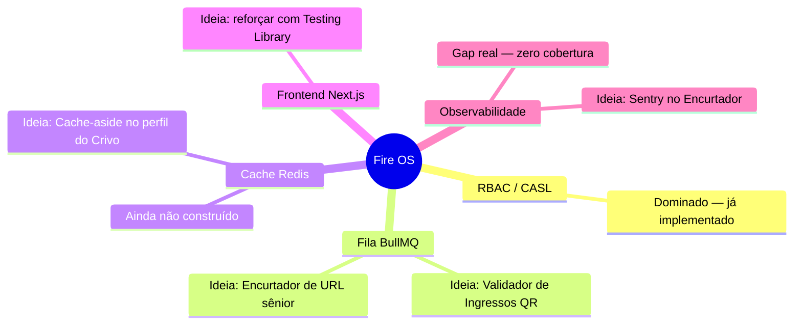

# Portfólio de Apps — Rumo ao Pleno

> **"Pleno não é cargo. É o que sobra depois que você constrói isso tudo."**
> **3 projetos pequenos. 1 currículo que para de parecer júnior.**

Ideia: em vez de um projeto grande só, um **portfólio de apps pequenos**, cada um simples de terminar, mas escolhido porque o problema em si **pede** uma solução de nível pleno — não é forçar Redis onde não precisa, é escolher um problema onde só dá pra resolver bem *com* Redis/fila/concorrência. Isso também serve como "banco de keywords": quando você for olhar requisitos de vaga pleno de verdade, dá pra cruzar aqui o que já está coberto e o que falta.

**Meta de commits por app:** ~40 a 80, atômicos. Prefira muitos commits pequenos e descritivos a poucos gigantes.

---

## Projeto 1: Extrator de Texto com IA — mesma lógica, 4 domínios possíveis

> *A IA faz o trabalho chato. Você só confere e salva.*

A base técnica é sempre igual, só muda **o que você está extraindo**: você cola um texto solto e bagunçado, a IA (Groq, Llama gratuito) organiza os dados num formato estruturado, você confere e salva. Em vez de escolher só uma dor, aqui estão 4 — dá pra construir uma, ou usar o mesmo esqueleto pra fazer mais de uma depois (o código de IA/Zod se repete quase igual entre elas).

### Opção A — Controle de gastos por recibo (v2 do `Controle-Financeiro-Sheets-API`)

Cola o texto de uma nota fiscal, recibo ou até só uma frase tipo "gastei 45 reais no mercado hoje", e a IA extrai valor, categoria, data e estabelecimento — sem digitar cada gasto na mão.

**Conferi o repositório real antes de sugerir isso** (`github.com/pablo-cruzbr/Controle-Financeiro-Sheets-API`), pra não assumir errado: apesar do nome, esse projeto **não tem backend seu** — é só um frontend (React + Vite) que escreve direto no Google Sheets através de um serviço terceiro (Sheet.best) fazendo esse papel de "API". Não tem Node, Express, Prisma, banco, nada seu do lado servidor.

Isso deixa a continuação bem clara: não é "adicionar mais uma tela", é **construir pela primeira vez o backend de verdade que esse projeto nunca teve** — trocando o Sheet.best (caixa preta terceira) por uma API sua (Node + Express + Prisma + Postgres), e usando essa troca como desculpa pra já nascer com IA extraindo os dados, Zod validando, testes, Docker, CI. O v1 provou que a ideia funciona (UI, gráfico por categoria); o v2 é a versão que mostra que você sabe construir a parte que faltava.

### Opção B — Tickets de suporte a partir de mensagens soltas

Cola uma mensagem de cliente reclamando de um problema (copiada do WhatsApp, e-mail, o que for), e a IA extrai o que é o problema, a prioridade e o produto/serviço afetado, virando um ticket estruturado. É literalmente o domínio do Fire OS (ordem de serviço) — só que num app novo, pequeno, focado só nessa parte de "transformar reclamação solta em ticket organizado".

### Opção C — Organizador de artigos/cursos pra estudar depois

Cola o link ou o texto de um artigo técnico, e a IA resume o conteúdo e extrai tags de tecnologia e nível (iniciante/intermediário/avançado), organizando sua lista de "pra estudar". Conecta direto com a sua própria jornada de virar pleno — em vez de salvar link e esquecer, você tem uma lista organizada por tema.

### Opção D — CRM de contatos de networking

Cola a bio de um perfil do LinkedIn, ou uma anotação rápida de um evento/hackathon ("conheci a Fulana, é tech lead na empresa X, falamos sobre Y"), e a IA extrai nome, empresa, cargo e o contexto de onde vocês se conheceram. Organiza sua rede de contatos profissionais — útil inclusive pra buscar vaga por indicação, que costuma ser mais eficaz que aplicar direto.

### Por que é simples, em qualquer uma das 4

Uma tela principal, um CRUD básico, uma chamada de IA. **Não precisa de fila nem cache pra funcionar** — isso vem depois, se você quiser evoluir. Dá pra terminar o MVP em poucos dias.

---

### O fluxo (MVP) — usando a Opção A (gastos) como exemplo, mas é igual nas outras 3

1. Você cola o texto solto (recibo, mensagem, artigo, bio — depende da opção escolhida) num campo grande
2. Aperta "Analisar com IA"
3. O frontend manda esse texto pro backend
4. O backend pede pra IA extrair os campos estruturados daquele domínio (no exemplo de gastos: valor, categoria, data, estabelecimento)
5. O formulário é preenchido sozinho com o que a IA devolveu — você confere e clica "Salvar"
6. O item aparece numa lista (gastos por mês, tickets por status, artigos por tema, contatos por empresa — depende da opção)

---

### A parte de IA — reaproveitando o que você já tem no Fire OS

O Fire OS **já** usa Groq (`src/api/ai/chat/route.ts`) — mas lá o padrão é fazer a IA responder uma pergunta em texto livre, com `generateText`. Aqui o objetivo é diferente: você não quer uma resposta em texto, quer **dado estruturado** (JSON) pra preencher um formulário. Pra isso existe `generateObject` (da mesma lib `ai` que o Fire OS já usa), que recebe um schema Zod e obriga a IA a devolver exatamente esse formato. Exemplo com a Opção A (gastos) — nas outras opções é o mesmo código, só troca o schema:

```ts
import { generateObject } from "ai";
import { createGroq } from "@ai-sdk/groq";
import { z } from "zod";

const groq = createGroq({ apiKey: process.env.GROQ_API_KEY });

const gastoSchema = z.object({
  valor: z.number(),
  categoria: z.enum(["mercado", "transporte", "lazer", "contas", "outros"]),
  data: z.string(),
  estabelecimento: z.string().nullable(),
});

const { object } = await generateObject({
  model: groq("llama-3.3-70b-versatile"),
  schema: gastoSchema,
  prompt: `Extraia os dados desse gasto:\n\n${textoColado}`,
});
```

**Por que isso é mais avançado do que parece, e conecta direto com o item 2 do `ROADMAP-PLENO.md` (Zod):** a IA pode "alucinar" ou devolver algo fora do formato esperado — o schema Zod aqui não é só documentação, é **validação de verdade** de uma fonte não confiável (a IA), do mesmo jeito que Zod validaria um `req.body` de um usuário. Se a IA devolver algo torto, o `generateObject` já rejeita antes de chegar no seu banco.

---

### Stack (tudo que você já conhece)

| Camada | Tecnologia |
|---|---|
| Frontend | Next.js (igual o Fire OS) |
| Backend | Node + Express + Prisma + Postgres (igual o Fire OS) |
| IA | Groq + Llama (`@ai-sdk/groq`, já está instalado no Fire OS) |
| Validação | Zod (aqui usado desde o dia 1 — diferente do Fire OS, que só tem no `/ai/chat`) |

### O que aplicar desde o dia 1 (diferente do Fire OS, que fez isso depois)

- [ ] Zod validando tanto o que o usuário manda quanto o que a IA devolve
- [ ] Testes (Vitest) pro service que chama a IA — mockando o `generateObject`, igual você já viu nos testes do Fire OS que mockam o Prisma
- [ ] `docker-compose.yml` com o Postgres versionado desde o primeiro commit
- [ ] CI rodando os testes a cada push

**RBAC não entra aqui de propósito** — é um app de um usuário só (você). Saber reconhecer que uma peça do roadmap **não** se aplica a um projeto pequeno também é raciocínio de pleno, não só empilhar tecnologia.

---

### Evolução natural, se quiser ir além depois do MVP

Sem pressa — só quando o básico estiver rodando e testado:

- **Fase 2 — fila (BullMQ):** lembrete agendado. Ex.: na Opção C (artigos), se um artigo fica salvo há muitos dias sem você marcar como "lido", agenda um job pra te lembrar (`delay` do BullMQ); na Opção A (gastos), um resumo semanal por e-mail. Se o envio falhar, tenta de novo sozinho (retry) — a parte de fila que o protótipo atual do Fire OS ainda não cobre.
- **Fase 3 — cache (Redis):** o painel com totais/contagens (gasto do mês, tickets por status, artigos por tema) vira cache-aside, em vez de recalcular toda vez.

Cada fase é um commit set separado e documentado — não precisa decidir isso agora, só saber que dá pra crescer sem jogar nada fora.

---

## Projeto 1B: Match de Vaga em Lote — a IA julga, não escreve

> *Pare de ler vaga por vaga. Deixa a IA dizer quais valem seu tempo.*

**Ganhou documento próprio: [`PROJETO-CRIVO.md`](./PROJETO-CRIVO.md)** — nome fictício "Crivo", com a spec completa (conceito técnico, como fica pleno, escopo, custo, referência visual do usefleming.com), mais conteúdo novo que não cabia aqui: uma tabela comparando decisão Junior vs. Pleno em cada parte do projeto, estimativa de tempo dia a dia, e o que estudar/revisar antes de começar. Copy de landing page fictícia em `design-references/crivo-landing-copy.md`.

Resumo rápido: você salva seu perfil, cola descrições de vaga (uma ou várias de uma vez), cada uma vira um job de fila, e a IA devolve um score de compatibilidade estruturado (0-100, o que bate, o que falta) — em vez de texto solto pra você interpretar.

`IA / LLM (Groq)` · `saída estruturada complexa (schema aninhado)` · `BullMQ (processamento em lote)` · `Zod` · `rate limiting` · `testes unitários`

---

## Projeto 1C: Bússola de Stack — a IA aponta o que estudar E o que construir

> *A dúvida que você teve agora mesmo, automatizada.*

### A piada não intencional aqui

Você pediu essa ideia rindo, mas repara: é literalmente **a dúvida que você teve agora** ("me dá outro projeto que cubra meus gaps") — só que em vez de perguntar pra mim numa conversa, o app faz isso sozinho, pra qualquer vaga que você colar. Extensão direta do Crivo, então reaproveita boa parte do que já foi desenhado ali.

### O que é, em uma frase

Extensão do Crivo (Projeto 1B): depois de comparar seu perfil com a vaga e achar os requisitos que faltam (isso o Crivo já faz), esse projeto dá **mais um passo**: analisa se a vaga é majoritariamente backend, frontend, fullstack ou IA, e sugere 1 a 3 ideias de projeto pequenas e específicas — pra fechar exatamente os gaps daquela vaga, considerando sua stack atual.

### O conceito novo que esse projeto ensina — encadeamento de chamadas de IA (prompt chaining)

No Crivo, é **uma** chamada de IA: perfil + vaga entram, veredito estruturado sai. Aqui são **duas chamadas em sequência**, onde a saída da primeira vira a entrada da segunda — isso se chama **prompt chaining** (ou pipeline de IA): em vez de tentar fazer a IA responder tudo de uma vez com um prompt gigante e confuso, você quebra o raciocínio em etapas menores, cada uma com um objetivo claro (é o mesmo princípio de dividir uma função grande em funções pequenas, aplicado a prompts).

```ts
// Passo 1 — igual ao Crivo: acha o gap entre perfil e vaga
const { object: gap } = await generateObject({
  model: groq("llama-3.3-70b-versatile"),
  schema: matchSchema, // o mesmo schema do Crivo
  prompt: `Compare o perfil e a vaga:\n\nPerfil: ${perfil}\n\nVaga: ${vaga}`,
});

// Passo 2 — NOVO: usa a SAÍDA do passo 1 como ENTRADA do próximo
const sugestoesSchema = z.object({
  areaDominante: z.enum(["backend", "frontend", "fullstack", "ia", "dados", "outro"]),
  sugestoesDeProjeto: z.array(z.object({
    nome: z.string(),
    justificativa: z.string(),
    stackFocada: z.array(z.string()),
    tempoEstimado: z.string(),
  })).max(3),
});

const { object: sugestoes } = await generateObject({
  model: groq("llama-3.3-70b-versatile"),
  schema: sugestoesSchema,
  prompt: `Com base nesses requisitos faltando: ${gap.requisitosFaltando.join(", ")},
sugira até 3 ideias de projeto pequenas e específicas pra fechar esse gap.`,
});
```

### Como fica pleno

- **Prompt chaining**: cada chamada de IA tem uma responsabilidade só — separar "avaliar compatibilidade" de "sugerir projeto" deixa cada prompt mais simples de acertar (e mais fácil de testar cada etapa isoladamente)
- **BullMQ**: as duas chamadas (passo 1 e passo 2) rodam dentro do mesmo job do worker, uma depois da outra — não precisa de fila nova, reaproveita a estrutura do Crivo
- **Zod**: dois schemas diferentes agora, um pra cada etapa — reforça o hábito de desenhar o formato de dado certo pra cada responsabilidade, em vez de um schema gigante genérico
- **Testes**: mockar as duas chamadas separadamente — inclusive testar o que acontece se a segunda chamada falhar mas a primeira já tiver terminado (o gap analysis não devia se perder)

### Fase 2 (inspirada no Oi Celine): de vaga colada pra repositório do GitHub, e de lista plana pra árvore

Você viu o produto de um amigo (**Oi Celine**, uma companheira de estudos com IA) e reparou num padrão que vale demais: em vez de só responder pergunta, ela **desenha o que você entendeu** (mapa mental) e guia a revisão pelo que ainda falta dominar. A ideia aqui é a mesma, aplicada a **repositórios**, não a anotações de aula.

**O que muda:** em vez de só colar uma vaga, você cola um **link de repositório público do GitHub**. A IA:
1. Busca a estrutura do repo (API pública do GitHub, sem precisar de autenticação pra repo público) — pastas, `package.json`, README
2. Analisa **por que** cada peça arquitetural existe (não só "tem Express", mas "por que tem fila, o que ela resolve ali") — é o mesmo exercício de rastreamento de fluxo que já treinamos no `ROADMAP-PLENO.md` (item "System Design"), automatizado
3. Desenha isso como **mapa mental** (não lista) — usando `mermaid`, a mesma sintaxe que você já vê renderizada no GitHub e nos meus documentos
4. A partir do mapa, propõe uma **árvore de projetos** — cada nó do mapa vira um ou mais galhos de "projeto pra ir mais fundo nisso"

**Plano visual — exemplo usando o próprio Fire OS como repo de entrada:**



Repara que isso é literalmente uma versão automática do que a gente já fez à mão nesse portfólio inteiro: achar o `can.ts` não ligado, identificar o gap de cache, sugerir o Encurtador pra fechar AWS/observabilidade — só que a IA faz isso sozinha, pra **qualquer** repositório, não só o seu.

**Por que isso é maior escopo que o resto do portfólio, dito com honestidade:**
- Buscar e interpretar estrutura de repositório é mais complexo que só ler um texto colado — precisa decidir o que mandar pra IA (não dá pra jogar o repo inteiro no prompt) e isso é, em si, uma decisão de engenharia
- Gerar `mermaid` válido via IA precisa de validação (Zod valida o *schema* dos nós/galhos antes de virar sintaxe mermaid, não o mermaid final direto — a IA gera dados estruturados, o código monta a sintaxe)
- Isso é **fase 2**, depois do MVP simples (vaga → gap → sugestões) estar rodando — não é o ponto de partida

### Conceitos/keywords que esse projeto cobre

`IA / LLM (Groq)` · `prompt chaining (pipeline de IA)` · `saída estruturada complexa` · `BullMQ` · `Zod` · `testes unitários` · `API do GitHub` · `geração de diagrama (mermaid)`

### Escopo

**Fase 1** (MVP, extensão simples do Crivo): não é um app novo do zero — só o passo 2 (schema novo + segunda chamada de IA + exibir as sugestões no card já existente). 3-5 dias, depois do Crivo já estar rodando.

**Fase 2** (inspirada na Celine, mapa mental + repo do GitHub): mais ambiciosa, conte mais 1-1.5 semana — só vale a pena depois que a Fase 1 e o resto do portfólio prioritário (Crivo, Encurtador) estiverem prontos e documentados.

---

## Projeto 2: Validador de Ingressos com QR Code (check-in de evento)

> *500 pessoas na porta ao mesmo tempo, e sua API nem pisca.*

### O que é, em uma frase

Você organiza um evento (meetup, hackathon, festa) e cada convidado recebe um ingresso digital com um código curto único. Na entrada, alguém escaneia o QR code e o sistema confirma na hora se aquele ingresso é válido.

### O problema de escala, explicado simples

Na abertura do evento, 500 pessoas chegam nos primeiros 10 minutos, todas querendo validar o ingresso ao mesmo tempo, na fila da entrada — e ninguém quer esperar 5 segundos parado na catraca. É um "hot moment" (em vez de "hot key"): não é um registro só sendo martelado como no encurtador de link viral, é **muitos registros diferentes sendo lidos em rajada, todos ao mesmo tempo** — mesmo problema de fundo (banco não aguenta sozinho), gatilho diferente.

### Como fica pleno

- `POST /ingressos` gera um código curto único pro convidado (geração de identificador sem colisão — base62 ou parecido, o mesmo mini problema de algoritmo do encurtador de link)
- `GET /ingressos/:codigo/validar` confere se o ingresso existe e ainda não foi usado — **cache-aside** no Redis primeiro, só vai no Postgres se não achar, respondendo em milissegundos mesmo com a catraca lotada
- **TTL**: o ingresso só é válido no dia do evento — o cache expira sozinho fora dessa janela, sem precisar de faxina manual
- **Rate limit** na validação: impede alguém parado na entrada testando códigos aleatórios tentando "adivinhar" um ingresso válido
- **BullMQ**: cada check-in confirmado dispara um job assíncrono que registra o log de entrada e atualiza a estatística de "quantos já chegaram" — sem atrasar a resposta pra quem está esperando passar

### Conceitos/keywords que esse projeto cobre

`Redis` · `cache-aside` · `TTL` · `rate limiting` · `BullMQ` · `geração de identificador curto (algoritmo)` · `testes unitários`

### Escopo

4-5 rotas, 1 worker. 1-2 semanas.

---

## Projeto 2B: Encurtador de URL — versão sênior

> *O mesmo projeto clássico de entrevista, construído com as decisões que separam quem sabe codar de quem sabe arquitetar.*

**Ganhou documento próprio: [`PROJETO-ENCURTADOR.md`](./PROJETO-ENCURTADOR.md)** — revive a ideia original de encurtador de URL (trocada por "Validador de Ingressos" mais acima), agora com profundidade sênior: as mesmas camadas de cache-aside e fila, mais duas coisas que nenhum outro projeto do portfólio cobre — **resiliência/fallback** (o que fazer quando o próprio Redis cai) e **deploy real em AWS Lambda** (fecha os gaps de "cloud real" e "serverless" de uma vez). Inclui uma régua de 3 níveis (Junior/Pleno/Sênior) pra mesma feature.

`Redis (cache-aside)` · `resiliência / fallback` · `BullMQ` · `AWS Lambda` · `arquitetura serverless` · `observabilidade` · `SOLID` · `testes unitários`

---

## Projeto 3: Enquete ao vivo (tipo Mentimeter/Slido, só que na unha)

> *5 mil votos ao mesmo tempo, zero perdido, zero duplicado.*

### O que é, em uma frase

Você cria uma pergunta com opções, compartilha um link, e as pessoas votam pelo celular — o resultado aparece **em tempo real** pra todo mundo assistindo, tipo um placar.

### O problema de escala, explicado simples

Se 5 mil pessoas votam ao mesmo tempo (numa live, numa palestra), dois problemas clássicos de concorrência aparecem: **(1)** como contar votos sem dois votos "pisarem" um no outro e sumirem, e **(2)** como impedir a mesma pessoa de votar 10 vezes.

### Como fica pleno

- Contagem de votos usando `INCR` do Redis — uma operação **atômica** (não tem como dois `INCR` ao mesmo tempo se atropelarem, o Redis garante isso sozinho; é diferente de fazer `total = total + 1` no seu código, que **pode** se perder numa condição de corrida)
- Um voto por pessoa: guardar quem já votou num Set do Redis, e checar antes de aceitar o próximo voto (isso é **idempotência** — garantir que repetir a mesma ação não tem efeito duplicado)
- Resultado atualizando sozinho na tela de todo mundo: **Redis Pub/Sub + WebSocket**, o mesmo conceito do "Painel Pleno" que já tínhamos esboçado — mas aqui aplicado a um problema onde múltiplas pessoas *de verdade* olham pro mesmo resultado ao mesmo tempo
- Rate limit pra impedir bot votando em massa

### Conceitos/keywords que esse projeto cobre

`Redis` · `operações atômicas` · `concorrência` · `idempotência` · `WebSocket` · `Pub/Sub` · `rate limiting` · `testes unitários`

### Escopo

Backend com WebSocket + 1 tela de votação + 1 tela de resultado. 2 semanas (a parte de WebSocket é a mais nova).

---

## Projeto 4: Sistema de reserva sem overbooking (agendamento/reserva de horário)

> *Dois cliques no mesmíssimo milissegundo. Só um ganha. Você decide qual.*

### O que é, em uma frase

Tipo marcar horário numa clínica, ou reservar mesa num restaurante: você escolhe um horário livre e confirma. O problema pleno mora numa pergunta simples — **o que acontece se duas pessoas clicam "reservar" no mesmíssimo horário, no mesmíssimo milissegundo?**

### O problema de escala, explicado simples

Sem cuidado nenhum, as duas requisições chegam "ao mesmo tempo", as duas checam "esse horário está livre?" (e recebem "sim" as duas), e as duas confirmam — **overbooking**: duas pessoas com o mesmo horário reservado. É um dos exemplos mais clássicos de **condição de corrida (race condition)** que existe, e toda plataforma de agendamento/e-commerce/ingresso precisa resolver isso.

### Como fica pleno

- **Lock distribuído com Redis** (`SET chave valor NX EX 10` — só consegue "travar" quem chegar primeiro; o segundo pedido é bloqueado até o primeiro liberar ou expirar): antes de confirmar a reserva, o backend tenta "travar" aquele horário; se não conseguir, já responde "esse horário acabou de ser reservado por outra pessoa" em vez de deixar os dois passarem
- **Transação no Prisma** (`prisma.$transaction`) garantindo que checar disponibilidade + criar a reserva aconteçam como uma coisa só, sem brecha no meio
- Confirmação por e-mail via fila (reaproveita o padrão de fila+retry do Projeto 1, fase 2)

### Conceitos/keywords que esse projeto cobre

`Redis` · `lock distribuído` · `race condition / concorrência` · `transações (ACID)` · `BullMQ` · `testes unitários` (esse aqui é ótimo pra testar concorrência de propósito — dois requests simultâneos no teste, provando que só um ganha)

### Escopo

O mais "conceitual" dos quatro — vale reservar 2-3 semanas, testar bastante o cenário de concorrência antes de considerar pronto.

---

## Cobertura de keywords (atualize conforme for vendo vagas de verdade)

| Keyword / conceito | Onde já aparece |
|---|---|
| Redis (cache) | Extrator de Texto com IA (fase 3), Validador de Ingressos |
| Redis (contadores atômicos) | Enquete ao vivo |
| Redis (lock distribuído) | Sistema de reserva |
| BullMQ / filas | Extrator de Texto com IA (fase 2), Match de Vaga (1B), Validador de Ingressos, Sistema de reserva |
| Retry / backoff | Extrator de Texto com IA (fase 2) |
| Rate limiting | Validador de Ingressos, Enquete ao vivo |
| TTL / expiração de cache | Validador de Ingressos |
| Geração de identificador curto (algoritmo) | Validador de Ingressos |
| WebSocket / Pub-Sub | Enquete ao vivo |
| Concorrência / race condition | Enquete ao vivo, Sistema de reserva |
| Idempotência | Enquete ao vivo |
| Transações (ACID) | Sistema de reserva |
| IA / LLM (Groq) | Extrator de Texto com IA, Match de Vaga (1B) |
| IA com saída estruturada complexa (schema aninhado) | Match de Vaga (1B) |
| Prompt chaining (pipeline de IA) | Bússola de Stack (1C) |
| Zod (validação) | Extrator de Texto com IA, Match de Vaga (1B) |
| Testes unitários (Vitest) | todos |
| Docker / CI | todos |
| RBAC / CASL | (nenhum ainda — todos são apps de usuário único; se algum virar multiusuário, entra aqui) |

**Como usar isso:** quando você colar requisitos de vaga pleno aqui depois, é só comparar a lista de keywords deles com essa tabela — o que já bate, vira ponto de currículo com prova (link do repo); o que não bate ainda, vira sinal de que precisa de mais um projeto pequeno (ou um ajuste num desses).

---

## Cruzamento com requisitos reais de vaga Pleno Fullstack (SP) — 25/08/2026

Você colou um panorama de requisitos reais de mercado (Node + React + TS, perfil Pleno, São Paulo). Cruzando item por item com tudo que já existe (Fire OS) e tudo que está planejado (esse portfólio):

### Core Tech Stack

| Requisito | Status | Onde |
|---|---|---|
| TypeScript avançado | ✅ Coberto | Fire OS (backend e frontend inteiros em TS) + o frontend do Hone (sua parte real lá) |
| Backend: NestJS | ❌ **Gap real** | Nenhum lugar — Fire OS e todos os projetos planejados usam Express puro |
| Backend: Express/Fastify | ✅ Coberto | Fire OS, e todos os projetos do portfólio |
| APIs RESTful | ✅ Coberto | Fire OS (+80 endpoints) |
| GraphQL | ❌ Não coberto | Baixa prioridade — a vaga aceita REST **ou** GraphQL, você já tem REST forte |
| ORM (Prisma) | ✅ Coberto | Fire OS e todos os projetos planejados |
| React/Next.js (SSR/SSG, App Router) | ✅ Coberto | Fire OS Frontend (Next.js 14, App Router) + Hone (Next.js 16, React 19 — sua parte real lá) |
| Gerenciamento de estado (Zustand/Redux/Context) | ✅ Coberto | Fire OS usa Context API — a vaga aceita explicitamente essa opção, não só Zustand/Redux |
| Estilização moderna (Tailwind/Styled Components/Shadcn) | ✅ Coberto | Não pelo Fire OS (usa SCSS Modules) — mas pelo **Hone**: o frontend usa Tailwind CSS v4 + shadcn/ui, e essa parte (frontend) foi de fato construída por você lá, diferente do backend |
| PostgreSQL | ✅ Coberto | Fire OS |
| Redis (cache) | ⚠️ Parcial → planejado ✅ | Hoje só prototipado pra fila. Dá pra virar cache-aside de verdade **dentro do próprio Crivo**, cacheando o perfil do usuário (ver "Minhas Dúvidas" abaixo) — não precisa esperar o Projeto 2 |
| Testes unitários/integração (backend) | ✅ Coberto | Fire OS (Vitest), reforçado em todos os projetos planejados |
| Testes de frontend (Testing Library/Cypress) | ❌ **Gap real** | Nenhum lugar — todo teste até agora foi backend |

### Engenharia de Software & Práticas

| Requisito | Status | Onde |
|---|---|---|
| SOLID / Clean Code / Design Patterns | ❌ **Gap real** | Aplicado intuitivamente em partes do Fire OS, mas nunca documentado ou nomeado conscientemente em lugar nenhum |
| Git Flow / PR detalhada / code review de pares | ❌ **Gap estrutural** | Já documentado no `ROADMAP-PLENO.md` — projeto solo não treina isso, é o tipo de gap que só fecha trabalhando com outra pessoa |
| Docker | ✅ Coberto | Fire OS |
| CI/CD (GitHub Actions) | ✅ Coberto | Fire OS |
| Cloud real (AWS/GCP/Azure — S3, Lambda, ECS) | ⚠️ Parcial → planejado ✅ | Fire OS usa Vercel + Cloudinary. Caminho pra fechar: **Projeto 2B** (`PROJETO-ENCURTADOR.md`), deploy real em AWS Lambda + API Gateway |

### Diferenciais

| Requisito | Status | Onde |
|---|---|---|
| Mensageria (RabbitMQ/Kafka/BullMQ) | ✅ Coberto | Protótipo testado ao vivo, planejado como peça central no Crivo |
| Microsserviços / Serverless | ⚠️ Parcial → planejado ✅ | Fire OS é monólito. Serverless (não microsserviço completo) fica coberto pelo **Projeto 2B** — deploy da função em AWS Lambda é arquitetura serverless de aplicação de verdade, diferente do Neon (que é só serverless de banco, ver "Minhas Dúvidas") |
| Observabilidade (OpenTelemetry/Datadog/Sentry/logs estruturados) | ❌ **Gap real** | Zero cobertura — hoje é só `console.log` espalhado |
| Inglês técnico | — | Não avaliável por código, fora do escopo desse documento |

### Cobertura do portfólio inteiro (Fire OS + Hone + Crivo) — não só um projeto isolado

Mesma contagem de antes (21 itens tecnicamente avaliáveis, excluindo "inglês"), mas agora somando **tudo que é seu de verdade** — nas 3 peças, contando só o que você pessoalmente construiu em cada uma (no Hone, isso significa só a parte de frontend/integração, não o backend dos colegas):

**Hoje, com o que já está construído e rodando (Fire OS + sua parte real do Hone):**

✅ Cobertos (12 de 21): TypeScript, Express, REST, Prisma, React/Next.js, gerenciamento de estado, **estilização moderna** (via Hone — Tailwind + shadcn), PostgreSQL, testes backend, Docker, CI/CD, mensageria (BullMQ, protótipo testado ao vivo).

⚠️ Parcial (1): SOLID/Clean Code — aplicado, não documentado conscientemente.

❌ Não cobertos (8): NestJS, GraphQL, Redis como cache (só como fila hoje), testes de frontend, Git Flow/code review em equipe, cloud real (AWS), microsserviços/serverless, observabilidade.

**→ 12 de 21 ≈ 57% hoje.**

**Projetado, depois do Crivo pronto (com os ajustes já planejados — Tailwind reforçado, Testing Library, Sentry):**

Some **testes de frontend** e **observabilidade**, que passam de ❌ pra ✅.

**→ 14 de 21 ≈ 67%**, com alta confiança (já está desenhado em detalhe no `PROJETO-CRIVO.md`, não é especulação).

**Atualização: descobrimos que "Redis como cache" não precisa esperar o Projeto 2** — dá pra adicionar cache-aside de verdade dentro do próprio Crivo (cacheando o perfil do usuário, ver "Minhas Dúvidas" abaixo). Com esse 4º ajuste:

**→ 15 de 21 ≈ 71%, só com o Crivo** — sem precisar do Projeto 2 pra isso especificamente (o Projeto 2 continua valendo por outros motivos: rate limiting, TTL, geração de identificador).

O que continua de fora mesmo nesse cenário otimista: NestJS, GraphQL, Git Flow/code review em equipe, cloud real, microsserviços. São os gaps que exigem uma decisão maior (trocar de framework, trabalhar com outra pessoa, mexer em AWS de verdade) — não dá pra fechar só ajustando escopo de projeto pequeno.

**As mesmas ressalvas de antes, valendo aqui em dobro:** isso é contagem simples de itens, não pesada por importância real; é uma régua rápida pra decidir prioridade, não substitui um recrutador ou ATS de verdade; e só fica realmente preciso quando cruzado com o texto de uma vaga específica, não um panorama geral de mercado.

### O que fazer com isso, dado o tempo que resta

Os gaps reais que mais pesam (NestJS, testes de frontend, estilização moderna, observabilidade, cloud) não cabem como projetos novos do zero — o jeito eficiente é **embutir cada um numa decisão de projeto que você já vai construir mesmo**, em vez de somar mais itens à lista:

- [ ] **NestJS**: o gap mais citado como "altamente requisitado" — em vez de migrar o Fire OS (não vale o risco/tempo), construa o **próximo** projeto do portfólio depois do Crivo (Projeto 2, 3 ou 4) em NestJS em vez de Express. Escolha deliberada, não acidente.
- [ ] **Estilização moderna + testes de frontend**: no Crivo, troque CSS/SCSS por **Tailwind** desde o início, e adicione alguns testes com **Testing Library** nas 2 telas — dá pra embutir isso no escopo do Crivo sem virar projeto novo
- [ ] **Observabilidade**: adicionar **Sentry** (tem free tier) + logs estruturados básicos no Crivo — algumas horas de trabalho, fecha um gap que hoje é zero em qualquer lugar
- [ ] **Cloud real**: se for fazer deploy de algum projeto, escolher **AWS** pra pelo menos uma peça (ex.: S3 pra armazenar algo, em vez de Cloudinary) em vez de só Vercel — não precisa ser tudo na AWS, só uma peça real
- [ ] **SOLID/Design Patterns**: mais barato de resolver — ao documentar decisões (o "molde de narrativa" que você já usa), nomear explicitamente qual princípio SOLID ou padrão de projeto está por trás de cada escolha, em vez de aplicar sem nomear
- [ ] **Code review em equipe**: continua sendo o único gap que nenhum projeto solo fecha — vale considerar pedir revisão de alguém (comunidade, ex-colega) num desses PRs, mesmo que informal

**Gaps que ficam de fora, de propósito, dado o tempo:** GraphQL e microsserviços/serverless — são "diferenciais", não obrigatórios, e o retorno por hora investida é menor que os itens acima.

---

## Minhas Dúvidas

Log de perguntas que fui fazendo enquanto cruzava o portfólio com a vaga real — pra não perder o que já foi respondido.

### Redis como cache — dá pra usar mais em algum lugar? No Crivo também, ou no Hone?

**No Hone: não conta, mesmo que exista lá.** Se a parte de cache existir no backend do Hone, ela foi construída pelo Guilherme/Vinicius, não por você (seu papel lá foi frontend/integração) — vale o mesmo princípio de sempre: só conta o que você constrói de fato.

**No Crivo: sim, dá pra usar de verdade, e nem precisa esperar o Projeto 2.** O candidato mais natural é cachear o **perfil do usuário** — ele é lido toda vez que uma vaga é avaliada (o worker busca o perfil pra montar o prompt de comparação), e escrito raramente (só quando você edita suas skills). É o exemplo clássico de cache-aside: muita leitura, pouca escrita.

```ts
async function getPerfil(userId: string) {
  const cacheKey = `perfil:${userId}`;
  const cached = await redis.get(cacheKey);
  if (cached) return JSON.parse(cached);

  const perfil = await prisma.perfil.findUnique({ where: { userId } });
  await redis.set(cacheKey, JSON.stringify(perfil), "EX", 3600); // expira em 1h
  return perfil;
}

async function updatePerfil(userId: string, data: PerfilInput) {
  const perfil = await prisma.perfil.update({ where: { userId }, data });
  await redis.del(`perfil:${userId}`); // invalida o cache no momento da escrita
  return perfil;
}
```

- [ ] Adicionar isso como 4º ajuste de escopo no Crivo (já documentado no `PROJETO-CRIVO.md`)

### Exemplos de SOLID/Design Patterns — no Fire OS e no Crivo

**No Fire OS, já existe isso, só nunca foi nomeado:**

- **Single Responsibility Principle**: `can.ts` só decide permissão por role, `authorizeOrdemdeServico.ts` só decide permissão por dono da OS — nenhum dos dois faz mais nada além disso, nem validação, nem lógica de negócio.
- **Open/Closed Principle**: `can(['ADMIN'])` é aberto pra extensão sem modificar o código — dá pra proteger uma rota nova com `can(['ADMIN', 'TECNICO'])` sem tocar em `can.ts`.
- **Dependency Inversion (leve)**: `authorizeOrdemdeServico` depende da abstração `ability.can(...)` (vinda de `defineAbilityFor`), não de um `if (role === 'ADMIN')` direto — trocar quem pode fazer o quê é mudar só a função que define a ability, o middleware nunca muda.
- **Violação honesta, boa de citar em entrevista**: `routes.ts` viola SRP no nível de arquivo — um arquivo só registrando +80 rotas de todos os domínios do sistema junto. Reconhecer isso ("eu sei que viola SRP, dividiria por módulo se fosse continuar crescendo") vale mais numa entrevista do que fingir que não existe.

**No Crivo, ainda não construído, mas já dá pra apontar onde vai aparecer:**

- **Single Responsibility**: no pipeline de duas etapas do Bússola de Stack (1C), a função que avalia compatibilidade (passo 1) e a que sugere projetos (passo 2) são separadas — cada uma com seu schema e seu prompt, nenhuma faz o trabalho da outra.
- **Separação de camadas (persistência vs. IA vs. fila)**: a função que chama a Groq, a que salva no Postgres e a que enfileira o job ficam em arquivos/funções diferentes — o handler da rota só orquestra, não faz nenhum dos três trabalhos ele mesmo.

### Neon (Postgres serverless) conta como microsserviços/serverless?

**Não sozinho — são duas coisas diferentes que têm a palavra "serverless" em comum:**

- **Serverless de banco (o que o Neon é):** você não gerencia o servidor do banco — ele escala e "dorme" sozinho. Isso é sobre **como o banco é hospedado**.
- **Serverless de aplicação (o que a vaga pede):** seu **código** roda como função sob demanda (AWS Lambda, Vercel Functions) em vez de um processo Express de longa duração ligado o tempo todo.
- **Microsserviços:** sua aplicação dividida em múltiplos serviços independentes, com deploy próprio, comunicando por rede — o oposto de um monólito como o Fire OS.

Usar Neon prova a primeira coisa, não as outras duas.

**Mas você não está em zero:** o padrão fila + worker que você já testou ao vivo (API e Worker rodando como **dois processos separados**, comunicando só via Redis) já é um passo real nessa direção — não é microsserviço completo (ainda é o mesmo repositório e o mesmo deploy), mas é a mesma ideia arquitetural por trás: responsabilidades separadas, comunicando por uma peça de infraestrutura em vez de chamada direta de função.

- [ ] Passo concreto pra chegar mais perto de verdade, se quiser: no Crivo, dar deploy do **worker como um serviço separado** (ex.: Railway, rodando isolado da API) em vez de rodar os dois juntos localmente — aí sim vira, na prática, dois serviços com deploy independente, não só dois processos na sua máquina.

---

## Qual construir nos próximos 3 meses — recomendação de 1 a 2 projetos

Você ainda vai gastar boa parte desses 3 meses aplicando pra vaga, se preparando pra entrevista e terminando itens do `ROADMAP-PLENO.md` (Zod nas rotas do Fire OS, mais testes, etc.) — então a pergunta certa não é "qual é o melhor projeto", é **qual cobre mais gap novo por semana de esforço, com risco baixo de não terminar**.

Olhando o que **ainda não está coberto em lugar nenhum** (nem no Fire OS, nem no protótipo de fila que já testamos ao vivo): cache-aside de verdade, TTL, rate limiting, IA com saída estruturada, e a validação Zod que segue em aberto desde o item 2 do roadmap.

### 1º — Projeto 2 (Validador de Ingressos)

**Por quê primeiro:** é o que fecha **mais gaps 100% descobertos** (cache-aside, TTL, rate limiting) no **menor tempo** (1-2 semanas) — e reaproveita BullMQ que você já testou ao vivo, então não tem curva de aprendizado nova ali, só a parte de Redis como cache é realmente nova. Baixo risco de não terminar dentro do prazo.

### 2º — Projeto 1 **ou** Projeto 1B, sua escolha

Os dois fecham o item 2 do roadmap (Zod) e a keyword de IA/LLM — a diferença é profundidade:

- **Projeto 1 (Extrator de Texto)**: mais rápido (poucos dias), IA em modo "pergunta e recebe pronto" (`generateObject`). Menor risco, termina mais fácil.
- **Projeto 1B (Match de Vaga em Lote)**: 1-2 semanas, e é o único do portfólio onde a IA **julga** em vez de escrever texto pra você ler — diferencial real frente a só usar um ChatGPT. Usa BullMQ de forma central (não opcional) pra processar várias avaliações em fila, e tem utilidade direta na sua busca de vaga agora. Também carrega o gancho pessoal de ser uma peça de IA construída por você do zero, do jeito que não foi no Hone (lá foi frontend/integração). Mais forte pra contar em entrevista, um pouco mais de risco de tempo que o Projeto 1 puro.

Se tiver que escolher só um dos dois: **Projeto 1B**, porque cobre tudo que o Projeto 1 cobre **mais** BullMQ e um schema de IA mais complexo — só vale trocar pelo Projeto 1 puro se sentir que o prazo está apertado e prefere garantir terminar rápido.

### Deixe pra depois (só se sobrar tempo de verdade)

**Projeto 3 (Enquete) e Projeto 4 (Reserva)** cobrem conceitos mais "densos" pra entrevista (concorrência, race condition, lock distribuído, WebSocket) — mas custam mais tempo (2-3 semanas cada) e têm mais risco de ficar pela metade. São ótimos, mas só valem a pena depois que os dois primeiros estiverem **terminados, documentados e no ar** — um projeto pequeno e completo vale mais numa entrevista do que dois pela metade.

**Resumo:** Projeto 2 → Projeto 1 → se sobrar tempo, Projeto 3 ou 4 (não os dois).

---

## Minhas Dúvidas

Log de perguntas que fui fazendo enquanto montava esse portfólio — pra não perder o que já foi respondido.

### O Projeto 1B (Tutor de Código) tem o que de diferente de simplesmente colar o código num ChatGPT/Gemini/Claude?

Resposta honesta: **do jeito que foi descrito originalmente, quase nada.** Colar um trecho de código, mandar pra uma IA e receber a explicação em streaming é exatamente o que esses chats já fazem de graça, sem eu precisar construir nada — se o objetivo fosse "ter uma ferramenta melhor que eles", o projeto não se sustentava.

Vale separar duas coisas que estavam misturadas sem eu deixar claro:

1. **Objetivo técnico** do Projeto 1B: praticar streaming (SSE) num domínio simples. Isso funciona como exercício de aprendizado mesmo sendo "uma casca fina" por cima da IA.
2. **Valor como peça de portfólio pra entrevista**: aí sim é fraco do jeito que estava — a primeira pergunta óbvia de quem revisar é "por que não só usar o ChatGPT?", e sem resposta boa o projeto não convence.

**O que resolveria isso, ainda não aplicado — aguardando decisão:** adicionar **RAG (Retrieval-Augmented Generation)** sobre o próprio repositório. Em vez de colar o trecho manualmente toda vez, o tutor "conhece" o projeto inteiro (indexa os arquivos) e busca sozinho o trecho relevante quando você pergunta algo — isso o ChatGPT genérico não faz sem você recolar contexto a cada pergunta. Também adiciona uma keyword forte e bem procurada (**RAG**) que nenhum outro projeto do portfólio cobre ainda.

- [ ] Decidir se vale a pena adicionar RAG ao Projeto 1B (aumenta o escopo e o tempo, mas resolve a diferenciação) antes de começar a construir ele.
