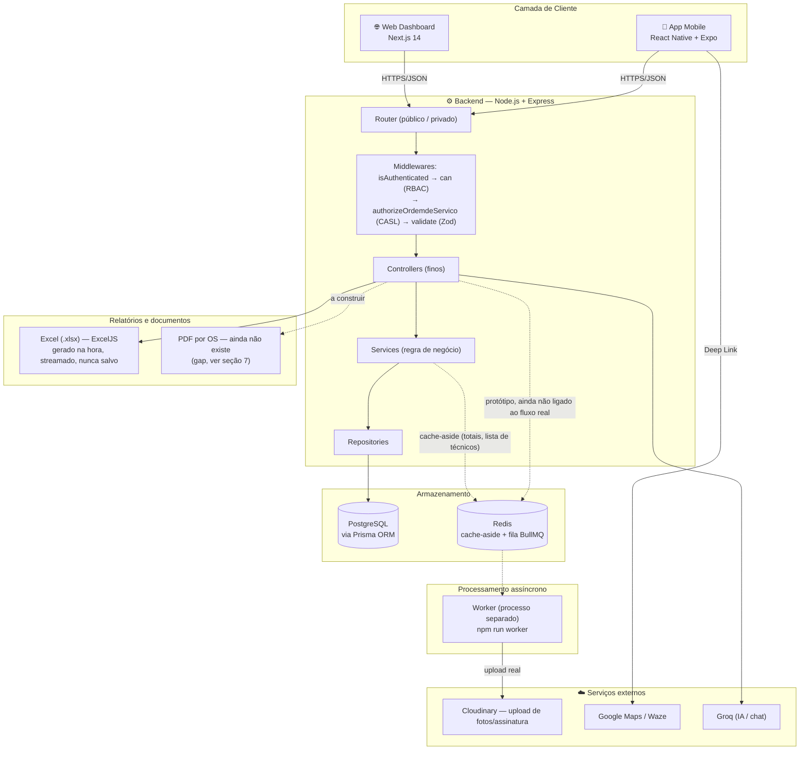
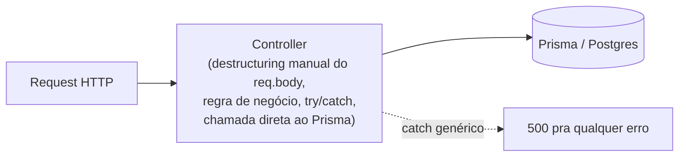
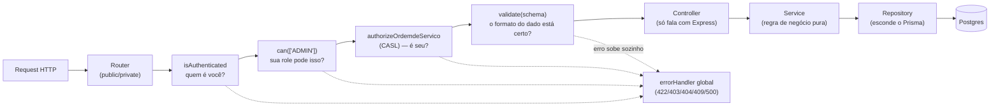
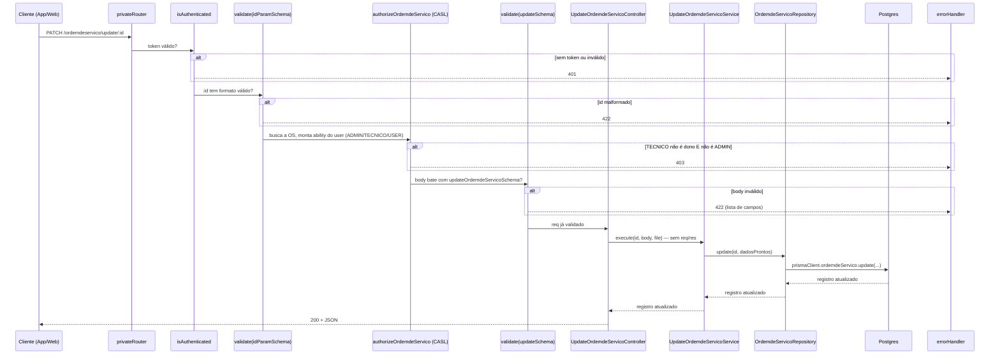
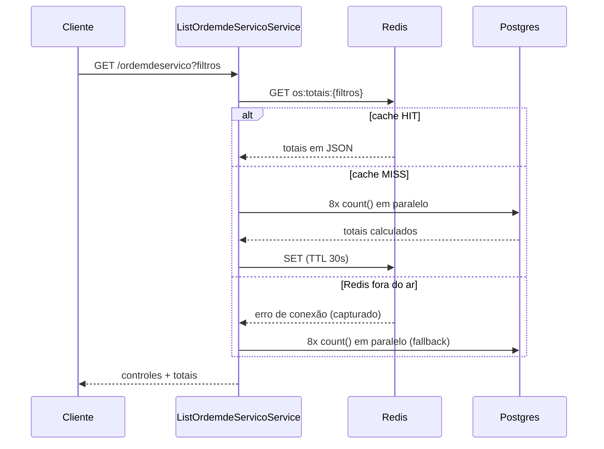

# Mapa de Arquitetura — Fire OS (Antes vs. Depois) + Estratégia pra vaga Fullstack Pleno

Documento separado dos outros guias (`GUIA-FILA-BULLMQ.md`, `GUIA-CACHE-REDIS.md`, `GUIA-PRIORIZACAO-PROXIMOS-PASSOS.md`) — aqui o objetivo é diferente: não é ensinar um conceito isolado, é dar um passo atrás e mostrar **a forma do sistema inteiro**, antes e depois de tudo que foi aplicado, e amarrar isso numa estratégia concreta de currículo/entrevista. Isso responde de vez dois itens que ficaram em aberto no `ROADMAP-PLENO.md` (seção "Minhas Dúvidas", System Design): desenhar o diagrama ponta a ponta e escrever a resposta pronta de "o que quebraria com 1000 técnicos".

**Como ler os diagramas abaixo, sem assumir que você já viu esse formato:**

- Blocos com setas sólidas (`graph TB` / `graph LR`) são **diagramas de componentes** — cada caixa é uma peça do sistema, cada seta é "essa peça fala com aquela". Setas tracejadas (`-.->`) marcam algo que existe mas não é o caminho principal (ex.: um protótipo ainda não ligado de verdade).
- Diagramas com `participant` e setas numeradas no tempo (`sequenceDiagram`) são **diagramas de sequência** — a mesma coisa que já foi explicada no `ROADMAP-PLENO.md` (glossário, item "diagrama de sequência"): mostram uma ação específica passando pelos componentes **na ordem em que acontece**, de cima pra baixo. Um bloco `alt` dentro dele é uma bifurcação — "se essa condição acontecer, o fluxo desvia pra cá em vez de continuar reto".
- Se o GitHub ou o VS Code não estiver renderizando o desenho (só mostrando o texto `mermaid`), é porque falta a extensão de preview — o conteúdo ainda é lido normalmente, só sem o desenho.

---

## 1. Visão geral do sistema hoje — as 3 camadas + a infraestrutura nova

O `README.md` raiz já tinha um diagrama das 3 camadas (Web, Mobile, API). Esse diagrama ficou **desatualizado** depois do trabalho recente — ele não mostra Redis nem a fila BullMQ, que hoje já existem no projeto. Versão atualizada:



**Leitura rápida do que mudou desde o diagrama original do README:**
- Redis deixou de ser "não existe" pra virar uma peça com **dois papéis diferentes**: cache-aside (produção, ligado de verdade) e fila BullMQ (protótipo isolado, ainda não ligado ao `fotoController.ts` real — ver `GUIA-FILA-BULLMQ.md`).
- O fluxo Client → API deixou de ser "uma caixa preta chamada API" e ganhou camadas visíveis (Router → Middlewares → Controller → Service → Repository) — isso é o que as seções 2 e 3 detalham.

- [ ] Atualizar o diagrama do `README.md` raiz com essa versão (hoje ele só reflete o estado pré-refatoração).

---

## 2. Arquitetura interna do Backend: antes vs. depois

### Antes — Controller sabia de tudo



Um arquivo só concentrava 4 responsabilidades: ler `req`/`res`, validar (ou não validar) o input, decidir a regra de negócio, e falar com o banco. O caso mais extremo disso no projeto era o `UpdateOrdemdeServicoService.ts` original — apesar do nome "Service", ele recebia `req`/`res` direto, fazia upload pro Cloudinary, montava o objeto de update campo a campo e tinha `try/catch` devolvendo status HTTP na mão. Era um Controller disfarçado de Service.

### Depois — cada camada com uma responsabilidade só



Cada seta é uma pergunta diferente sendo respondida, na ordem certa — e cada uma delas hoje é uma peça isolada e testável (`can.test.ts`, `ability.test.ts`, `authorizeOrdemdeServico.test.ts`, `validate.test.ts`, `errorHandler.test.ts`, `OrdemdeServicoRepository.test.ts`). No modelo antigo, essas perguntas estavam misturadas (quando existiam) dentro do Controller, sem teste nenhum cobrindo cada uma isoladamente.

**O termo que aparece na tabela da seção 5 e ainda não foi explicado aqui: injeção de dependência.** É o nome do porquê o `Repository` deixa o `Service` fácil de testar. Em vez do `Service` criar/importar o Prisma sozinho (ficando "preso" a ele), ele **recebe** o Repository de fora, no construtor (`constructor(private repository = ordemdeServicoRepository)`) — quem chama o `Service` decide o que entregar. Em produção, ninguém passa nada e ele usa o Repository de verdade (o valor padrão). No teste, você passa um objeto fake no lugar (`{ create: vi.fn(), update: vi.fn() }`), e o `Service` nem percebe a diferença — ele só sabe que recebeu "algo que sabe criar/atualizar", não que é um Prisma de verdade ou uma simulação. É essa troca (o `Service` não decide mais de onde vem sua dependência, só recebe ela pronta) que o termo "injeção de dependência" descreve.

**Ainda parcial:** esse padrão completo (as 4 camadas + Zod) só está aplicado no par Create+Update de OrdemdeServico. Os outros ~100 controllers (confirmado: 106 arquivos em `controllers/`, 106 em `services/`) ainda estão no modelo "antes" — é o item de maior volume pendente no `CHECKLIST-REFATORACAO-BACKEND.md`.

---

## 3. Fluxo real de uma requisição, ponta a ponta

Pegando o caso mais completo hoje no projeto — `PATCH /ordemdeservico/update/:id`, que passa por autenticação, autorização por role, autorização por dono (CASL) e validação de schema, todos já implementados de verdade:



Cinco pontos de saída diferentes pro `errorHandler`, cada um por um motivo diferente — isso é o que "tratamento de erro global" quer dizer na prática: nenhuma dessas camadas escreve `res.status(...)` na mão, todas só lançam o erro certo e deixam a camada central decidir o formato da resposta.

---

## 4. Fluxo de cache — o mesmo request, mas de leitura

Pra listagem (`GET /ordemdeservico`), que dispara o `getTotais()` com cache-aside:



Detalhes completos (por que 30s, por que a chave inclui os filtros, o que muda no `ListTecnicoService` com invalidação ativa) estão no `GUIA-CACHE-REDIS.md`.

---

## 5. Antes vs. depois, por pilar — o que ganhou de verdade

| Pilar | Antes | Depois | Vantagem prática |
|---|---|---|---|
| **Autorização** | `can.ts` existia mas não era usado; qualquer role logada acessava as mesmas 80+ rotas | `publicRouter`/`privateRouter` + `can([...roles])` + CASL (`authorizeOrdemdeServico`) nas rotas de OS | Um `TECNICO` não edita mais OS de outro técnico; ações admin (delete de cliente/instituição) exigem `ADMIN` de verdade |
| **Validação de entrada** | `const {x,y,z} = req.body` direto, sem checagem — erro malformado virava 500 genérico | Schema Zod (`validate()`) nos endpoints de Create/Update/detail de OrdemdeServico | Erro de input vira 422 com a lista exata de campos errados, antes de qualquer lógica rodar |
| **Tratamento de erro** | `try/catch` repetido em cada controller, cada um decidindo status na mão | `errorHandler` global, `AppError`/`ValidationError`/`NotFoundError`/`ConflictError`, zero `try/catch` nos 2 controllers refatorados | Um erro do Prisma (`P2002`, `P2025`, `P2003`) já vira o status HTTP certo automaticamente, em qualquer módulo que adotar o padrão |
| **Acesso a dados** | Service chamava `prismaClient.ordemdeServico.*` direto — teste precisava mockar o módulo do Prisma inteiro | Repository (`OrdemdeServicoRepository`) isola o Prisma; Service recebe repository via injeção de dependência | Teste do Service usa repository fake, sem saber que existe um Prisma por trás — troca de ORM no futuro afetaria só o Repository |
| **Cache** | Toda listagem de OS refazia 8 `count()` a cada request, sempre | Cache-aside com Redis (TTL 30s em OS, 60s + invalidação ativa em técnico), com fallback se o Redis cair | Menos carga no Postgres sob tráfego normal, sem risco de a rota cair se o Redis cair |
| **Processamento assíncrono** | Upload de fotos síncrono, dentro do request — tela do técnico trava esperando o Cloudinary | Protótipo isolado de fila (BullMQ + Redis) validado — ainda não ligado ao fluxo real | Prova de conceito rodando de verdade (testada com 4 jobs reais, logs comprovando concorrência 1), pronta pra ligar quando fizer sentido |
| **Testes** | 4 arquivos de teste, cobertura rasa, sem cobrir middleware nenhum | 58 testes (Vitest), cobrindo RBAC/CASL, validação, erro, repository fake, cache (miss/hit/fallback) | Middleware mais crítico do sistema (`can.ts`) hoje tem teste — antes tinha zero |
| **CI** | `test.yml` só rodava `npm run test` | (ainda igual — próximo item do checklist) | — pendente: `tsc --noEmit` + lint como steps separados |
| **Docker** | Só Postgres containerizado; API rodava direto no Node local | `Dockerfile` multi-stage pra API + `.dockerignore` + `docker-compose.yml` com os 3 serviços (`fireos-api`, `fireos-db`, `fireos-redis`) | Ambiente reproduzível em qualquer máquina — sintaxe validada, build real ainda não testado numa máquina com Docker de pé |
| **Relatórios/Documentos** | — | Excel (`ExportOrdemdeServicoController.ts`) já existe, gerado sob demanda; PDF por OS específica ainda **não existe** | Ver seção 7 — decisão em aberto sobre storage (S3 vs. Cloudinary vs. nenhum) |

---

## 6. System design: "o que quebraria com 1000 técnicos usando ao mesmo tempo?"

Essa é a pergunta clássica de entrevista de system design, e o item ainda estava em aberto no `ROADMAP-PLENO.md`. Três respostas prontas, cada uma apontando pra um arquivo/decisão real do projeto — não teoria genérica:

1. **O Postgres, não a API, seria o primeiro gargalo.** Primeiro os termos, do zero: **escalar horizontalmente** é lidar com mais uso subindo *mais cópias* do mesmo servidor (2, 5, 10 instâncias da API rodando em paralelo) — o oposto de escalar **verticalmente**, que é dar mais recurso (CPU/RAM) pra uma instância só. Uma API é **stateless** ("sem estado") quando ela não guarda nada sobre o usuário na própria memória entre um request e outro — é isso que o JWT faz aqui: o token carrega `role`/`tecnico_id` dentro dele mesmo, então não importa qual das 10 instâncias atende o próximo request, todas conseguem validar o mesmo jeito. Isso é pré-requisito pra escalar horizontalmente (se a sessão vivesse na memória de uma instância só, o usuário precisaria sempre cair na mesma).

   Só que isso resolve a API, não o banco. Cada instância abre seu próprio **pool de conexões** (um "estoque" de conexões já abertas com o Postgres, reaproveitadas entre queries, em vez de abrir/fechar uma conexão nova a cada query — abrir conexão é caro). O Postgres tem um teto de quantas conexões simultâneas ele aceita no total (`max_connections`, ~100 por padrão) — com 10 instâncias, cada uma com seu próprio pool, esse teto estoura rápido. **PgBouncer** é a ferramenta que resolve isso: um pool **único e compartilhado**, na frente do banco, que todas as instâncias da API usam — em vez de 10 pools brigando pelas mesmas 100 conexões, existe um só, gerenciado num lugar central.

2. **O cache-aside que acabei de implementar teria um ponto cego real: cache stampede.** Com 30s de TTL e centenas de técnicos abrindo a listagem de OS ao mesmo tempo, o instante em que o TTL expira vira um pico de N requisições simultâneas todas dando *miss* junto — 8 `count()` × N, de uma vez. A correção não é abandonar o cache, é adicionar uma trava simples (`SETNX` no Redis) ou trocar os 8 `count()` por uma agregação condicional (`COUNT(*) FILTER (WHERE ...)`), reduzindo o custo de cada miss simultâneo (detalhado no `GUIA-CACHE-REDIS.md`).

3. **O upload síncrono de fotos (`fotoController.ts`) é o que mais sentiria o volume.** Hoje cada foto sobe pro Cloudinary dentro do request, uma de cada vez — com 1000 técnicos em campo mandando fotos ao mesmo tempo, isso vira centenas de requests HTTP simultâneos todos esperando uma chamada de rede externa (Cloudinary) terminar. É exatamente o problema que o protótipo de fila (BullMQ) já resolve na teoria — ligar isso no fluxo real deixaria de ser "melhoria", viraria necessidade.

**Bônus, fora do que já foi medido:** o `schema.prisma` tem 567 linhas num arquivo só — isso ainda não é gargalo de performance (Prisma lida bem com schema grande), mas é gargalo de manutenção: qualquer PR que mexa em model vira um diff difícil de revisar. Vale nomear isso numa entrevista como "o que eu mudaria antes de qualquer coisa relacionada a tráfego" — é o tipo de resposta que mostra que você enxerga além de "escalar = mais servidor".

- [x] Diagrama ponta a ponta desenhado (seções 1, 3 e 4 acima) — resolve o item pendente do `ROADMAP-PLENO.md`.
- [x] As 3 frases prontas sobre 1000 técnicos — resolve o outro item pendente.

---

## 7. Relatórios e documentos (Excel/PDF) — e por que S3 não é a primeira pergunta

**O que já existe, e que não estava mapeado aqui até agora:** `GET /ordens/exportar` (`ExportOrdemdeServicoController.ts`) já gera um relatório Excel de verdade, com `ExcelJS`, filtrando pelos mesmos parâmetros da listagem (`startDate`, `cliente_id`, `status_id`, etc.). **O que ainda não existe:** um PDF de uma Ordem de Serviço específica por `id` — não achei nenhum arquivo nem dependência de PDF no projeto (`pdfkit`, `puppeteer`, etc. não estão instalados). É um gap real, não uma dúvida sobre onde procurar.

### O conceito que decide a resposta, antes de falar de S3: gerar sob demanda vs. persistir

Existem duas formas bem diferentes de servir um arquivo gerado (Excel, PDF, qualquer relatório):

```
A) Gerar e streamar (o que o Excel já faz hoje):
   request chega → gera o arquivo em memória → escreve direto na resposta
   HTTP → nunca toca disco nem storage nenhum → arquivo "não existe"
   depois que a resposta termina

B) Gerar e persistir (o que ainda não existe em lugar nenhum do projeto):
   request chega → gera o arquivo → salva num storage (S3, Cloudinary,
   disco) → devolve uma URL → próximas vezes servem a URL direto,
   sem regerar
```

**O Excel de hoje é a opção A, e está certo assim.** Repare no `worksheet.columns` do `ExportOrdemdeServicoController.ts`: o relatório é montado a partir de filtros (`startDate`/`cliente_id`/`status_id`/...) — cada combinação de filtro gera um arquivo **diferente**. Persistir isso num storage teria uma taxa de reaproveitamento quase nula (o mesmo raciocínio de "cache não vale a pena quando o dado muda a cada request", só que aplicado a um arquivo em vez de uma query — ver `GUIA-CACHE-REDIS.md`). Guardar isso em S3 seria pagar armazenamento por arquivos que quase nunca seriam lidos duas vezes.

### O PDF por OS é diferente — aí a pergunta "vale persistir?" já faz sentido

Um PDF de uma OS específica tem uma característica que o Excel não tem: **a chave é estável** (o `id` da OS) e, depois que a OS é concluída e assinada, o conteúdo praticamente não muda mais. Isso muda a resposta:

- **Se o uso é só "baixar o PDF quando alguém pedir"**: não precisa de storage nenhum — mesma abordagem do Excel (gera na hora, streama, descarta). Mais simples, zero infraestrutura nova, resolve o caso comum.
- **Se o uso inclui "quero um link permanente pra essa OS" (prova de serviço concluído, compartilhar sem precisar estar logado, histórico que não pode sumir)**: aí sim vale persistir — e é aqui que entra a pergunta do S3.

### S3 ou Cloudinary, se a resposta for "sim, persistir"

**Minha recomendação: não é S3 — é reaproveitar o Cloudinary que já está integrado**, pelo mesmo motivo que gera a maior parte das decisões boas de arquitetura desse projeto: consistência. O Cloudinary já é o storage de arquivo oficial do Fire OS (fotos da OS, assinatura do cliente), já tem credencial configurada, já tem código de upload testado, e aceita PDF normalmente (`resource_type: "raw"` ou `"auto"`). Somar S3 como um **segundo** provedor de storage, só pra esse caso, adiciona: uma conta AWS pra gerenciar, IAM/bucket policy pra configurar com segurança, outra credencial pra guardar — sem resolver nada que o Cloudinary já não resolvesse.

**Isso também não é uma opinião isolada — bate com uma decisão que já está registrada no projeto:** o `CHECKLIST-REFATORACAO-BACKEND.md` (item 5) já decidiu deixar "AWS de verdade" fora do Fire OS por ora, justamente porque existe outro projeto (`PROJETO-ENCURTADOR.md`) planejado especificamente pra cobrir esse gap de currículo (Lambda + API Gateway) sem duplicar esforço. Trazer S3 pra dentro do Fire OS agora iria contra essa decisão sem um motivo técnico novo forte o suficiente pra justificar reabri-la.

**Quando eu mudaria de ideia:** se um dia existir um motivo específico que o Cloudinary não cobre bem — política de retenção/expiração formal por exigência legal, controle de acesso via IAM mais granular que o token do Cloudinary, ou custo em escala grande — aí sim S3 vira a resposta certa. Hoje, com o volume do Fire OS, esse motivo não existe ainda.

- [ ] Decidir: o PDF por OS precisa ser permanente (persistido) ou só "gerar e baixar" resolve? Essa resposta decide se entra storage nenhum.
- [ ] Se decidir persistir: implementar upload de PDF pro Cloudinary (reaproveitando o cliente já configurado), não S3.
- [ ] Escolher a lib de geração de PDF (nenhuma está instalada hoje) — candidatos comuns em Node: `pdfkit` (leve, desenha o layout na mão) ou `puppeteer`/`@react-pdf/renderer` (renderiza um template HTML/JSX como PDF, mais fácil de estilizar parecido com o Excel atual).

---

## 8. Como isso te ajuda a conseguir vaga de Fullstack Pleno

### A base já favorável: você não está construindo uma narrativa fullstack do zero

O sistema (mermaid da seção 1) já tem as 3 pernas de um fullstack de verdade — Web (Next.js), Mobile (React Native) e API (Node/Express) — **em uso real, com 44 OS concluídas em campo**, não é projeto de portfólio sem usuário. Isso já é mais raro do que parece: a maioria dos candidatos pleno mostra CRUDs isolados, não um sistema com 3 clientes diferentes conversando com a mesma API em produção.

O trabalho recente (RBAC, Zod, error handling, Repository, cache) foi todo no **Backend** — é aqui que mora o maior ganho de narrativa, porque é a parte onde "eu sei usar" vira "eu sei explicar o porquê", que é exatamente o que diferencia pleno de júnior numa entrevista técnica.

### Cada pilar da seção 5 é um bullet de currículo/LinkedIn com prova, não afirmação

Frases genéricas tipo "conhecimento em cache e autorização" não convencem. Frases ancoradas no achado real convencem:

- ❌ "Implementei RBAC no backend."
- ✅ "Encontrei um middleware de RBAC escrito mas nunca ligado às rotas — qualquer usuário autenticado acessava as mesmas 80+ rotas, incluindo deletar cliente. Apliquei `can()` + CASL, com ownership real (técnico só edita a própria OS), e testei os 3 casos (autorizado, sem role, role errada)."

- ❌ "Implementei cache com Redis."
- ✅ "Identifiquei que a listagem de OS rodava 8 queries de contagem a cada request. Implementei cache-aside com TTL calibrado pelo tipo de dado (30s pra um contador que muda toda hora, 60s + invalidação ativa pra uma lista que muda raramente) — com fallback testado pra o Redis cair sem derrubar a rota."

Isso é literalmente o "molde da narrativa" que já está documentado no `ROADMAP-PLENO.md` — a diferença agora é que você tem **material pronto pra 5 pilares diferentes**, não só um.

### A estratégia, sem repetir o que o `ROADMAP-PLENO.md` já disse

O roadmap já é claro sobre o ponto mais importante: o filtro de "X anos de experiência" no ATS não muda em 3 meses, então a estratégia é mirar empresas que testam habilidade de verdade (teste técnico, live coding, indicação) em vez de confiar só na palavra "pleno" no anúncio. Em cima disso, três coisas concretas que esse mapa de arquitetura adiciona:

1. **Tenha esse arquivo (ou um resumo dele) pronto pra puxar num teste técnico ou entrevista system design** — quando perguntarem "me conta de um projeto que você é dono do início ao fim", a resposta não é "fiz um CRUD", é abrir esse mapa e apontar pra decisões específicas com trade-off nomeado.
2. **Pratique responder as perguntas de "por quê", não só "o quê"** — os 6 termos do glossário do `ROADMAP-PLENO.md` (RBAC, Zod, pirâmide de testes, CI/CD, Docker, system design) mais os 5 que foram adicionados depois (fila, cache, escala horizontal, revisão de código, os termos que faltam) — isso é o syllabus, e você já tem exemplo real do Fire OS pra cada um.
3. **Continue fechando o `CHECKLIST-REFATORACAO-BACKEND.md`, na ordem do `GUIA-PRIORIZACAO-PROXIMOS-PASSOS.md`** — cada item fechado não é só "código melhor", é mais um pilar na tabela da seção 5 virando bullet de currículo. O rollout de Zod/Repository pros outros módulos é o que mais falta hoje, e também o que mais teria peso, porque mostra que o padrão não foi sorte de um módulo só.

### O que esse mapa não resolve sozinho — honestidade, não venda

Igual o roadmap já registrou: esse projeto não ensina fila/mensageria em produção real (só protótipo), escala horizontal de verdade (múltiplas instâncias, banco com réplica), revisão de código em equipe (projeto solo), nem algoritmos/estrutura de dados. Isso não invalida a narrativa — só significa que, depois de fechar o checklist, o retorno de continuar cavando só aqui cai, e vale complementar com estudo de system design geral e, se possível, ter alguém revisando seu código de verdade.

---

## 9. Onde aprofundar cada assunto — este arquivo é o mapa, não o território

Esse documento existe pra você enxergar o sistema inteiro de uma vez (a "floresta"). Cada pilar da tabela da seção 5 tem um guia dedicado explicando o conceito do zero, com antes/depois de código real (as "árvores") — use a tabela abaixo pra saber pra onde ir quando quiser entender um pilar a fundo, não só de relance:

| Se você quer entender a fundo... | Vá pra |
|---|---|
| Fila, BullMQ, Redis como fila, producer/worker | `GUIA-FILA-BULLMQ.md` |
| Cache, cache-aside, TTL, invalidação, cache stampede | `GUIA-CACHE-REDIS.md` |
| Por que essa ordem de prioridade no que falta (rollout, CI, testes) | `GUIA-PRIORIZACAO-PROXIMOS-PASSOS.md` |
| RBAC, CASL, Zod, error handling, Repository — com o "achado real" de cada um | `ROADMAP-PLENO.md` (é o mais longo, mas é onde está o detalhe passo a passo) |
| Estado atual de cada item (o que já foi feito, o que falta) | `CHECKLIST-REFATORACAO-BACKEND.md` |

Se um termo te deixar em dúvida, procure primeiro no `ROADMAP-PLENO.md` — o glossário dos "6 termos" (RBAC, Zod, pirâmide de testes, CI/CD, Docker, system design) e dos "5 termos que faltam" (fila, cache, escala horizontal, revisão de código) cobre praticamente tudo que aparece nos diagramas acima.

---

## 10. Próximos passos

- [ ] Atualizar o diagrama mermaid do `README.md` raiz com a versão da seção 1 (Redis + fila, hoje ausentes lá).
- [ ] Continuar o checklist na ordem do `GUIA-PRIORIZACAO-PROXIMOS-PASSOS.md` — cada item fechado vira uma linha nova na tabela da seção 5.
- [ ] Quando (se) a fila for ligada ao `fotoController.ts` de verdade, atualizar o diagrama da seção 1 (hoje a seta Redis→Worker está tracejada porque é só protótipo).
- [ ] Decidir e, se fizer sentido, implementar o PDF por OS (seção 7) — gerar/streamar primeiro, storage só se for confirmado que precisa de link permanente.

Checklist de estado atual: `CHECKLIST-REFATORACAO-BACKEND.md`. Raciocínio e exemplos de cada item: `ROADMAP-PLENO.md`.
