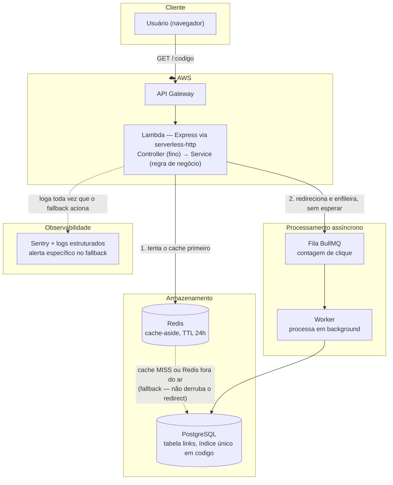
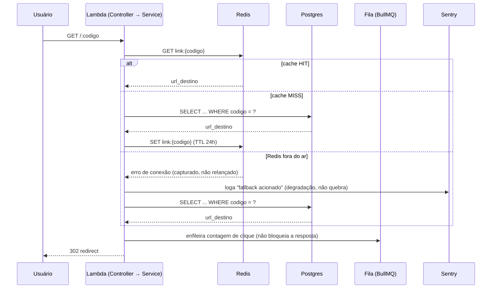

# Encurtador de URL — Rumo ao Nível Sênior

> *O mesmo projeto clássico de entrevista, construído com as decisões que separam quem sabe codar de quem sabe arquitetar.*

Revive a ideia original de "Encurtador de URL" (trocada por "Validador de Ingressos" no `../IDEIAS-PROJETOS-PLENO.md`), agora aprofundada — inspirada nos tópicos de uma página que você encontrou, adaptada e construída com conhecimento próprio pro seu caso específico.

## Antes de tudo: o que é um "encurtador de URL", explicado do zero

Esquece o código por um instante. Um encurtador de URL faz uma coisa só: você dá um endereço gigante (`https://loja.com/produtos/categoria/eletronicos/celular-xyz-modelo-2026?ref=instagram&campanha=promo`) e ele te devolve um apelido curtinho (`encurtador.com/abc123`). Quando alguém clica no apelido, o sistema lembra qual era o endereço gigante e manda a pessoa pra lá.

É a mesma ideia de um crachá de visitante numa empresa: em vez de gritar "Fulano de Tal, CPF tal, que veio visitar o setor tal, às 14h32" toda vez que alguém olha pra você, você só mostra o crachá com um número — e a recepção, com aquele número, consegue puxar todos os seus dados no sistema dela. O "código curto" (`abc123`) é o crachá; o "endereço gigante" é os dados completos por trás dele.

**Por que esse projeto de brinquedo ensina tanta coisa de gente grande?** Porque, apesar de parecer simples ("só troca um texto grande por um texto pequeno"), ele tem um problema de escala clássico escondido dentro: e se um link específico (ex.: um link que um influenciador colocou no story) receber 50 mil cliques no mesmo minuto? Isso é o mesmo tipo de pico que qualquer sistema de verdade enfrenta (Black Friday numa loja, virada de ano numa rede social) — só que aqui, pra estudar, cabe em 2 rotas de código. O resto deste documento é sobre como se preparar pra esse pico sem o sistema cair — e é exatamente aí que mora a diferença entre júnior, pleno e sênior (seção final).

## Bate exatamente com a nossa ideia original, ou não?

**É o mesmo projeto central (encurtador de URL, cache pra escala), mas em duas profundidades diferentes** — e esse documento aqui já é a fusão das duas. Comparando lado a lado:

| | Nossa ideia original (Project 2, antes de virar Ingressos) | Encurtador do curso | Esse documento (2B) |
|---|---|---|---|
| API + Postgres + geração de código curto | ✅ | ✅ | ✅ |
| Cache-aside (Redis) | ✅ | ✅ | ✅ |
| Rate limiting na criação de link | ✅ | Não mencionado | ✅ (mantido) |
| Fila pra contagem assíncrona de clique | ✅ (BullMQ) | ✅ (RabbitMQ) | ✅ (BullMQ) |
| Resiliência — o que fazer se o Redis cair | ❌ Não tinha | ✅ (uma das 7 perguntas centrais) | ✅ **adicionado** (seção "Camada de resiliência") |
| Observabilidade / tracing | ❌ Não tinha | ✅ | ✅ **adicionado** |
| Deploy real em cloud (AWS) | ❌ Não tinha | ✅ | ✅ **adicionado** (Lambda + API Gateway) |
| Escopo estimado | 1 semana | 4 noites (curso guiado) | 1.5-2.5 semanas (sozinho, sem guia) |

**Resumindo:** nossa ideia original já cobria a metade "clássica de entrevista" (cache, rate limit, fila) — o que faltava, e é exatamente o que separa pleno de sênior na página do curso, é a metade "produção de verdade" (resiliência, observabilidade, cloud real). Foi isso que eu incorporei quando reescrevi esse documento — não é coincidência bater, é porque eu especificamente preenchi o gap entre as duas quando você mandou o link.

---

## Por que isso bateu com o seu caso

Você compartilhou essa página não pelo curso em si, mas porque o **problema que ela descreve é literalmente o seu agora**. Vale registrar por quê, com precisão:

- **"Saber codar é só uma parte do trabalho" / "o gap entre saber programar e saber construir software"** — é exatamente a distância entre o Fire OS "funcionando" (47 OS processadas, uso real) e o Fire OS que a gente foi destrinchando nesse roadmap inteiro: RBAC escrito mas nunca ligado, Zod ainda em aberto, `routes.ts` com 80 rotas sem estrutura. Você já sabe fazer o sistema **funcionar**; o que estamos treinando há semanas é o próximo degrau, fazer ele **aguentar crescer**.
- **"Talvez você já saiba criar componentes, APIs, integrar banco de dados e colocar projetos no ar. Mas quando a aplicação fica maior, você sente que ainda está apenas juntando peças"** — é a mesma sensação por trás de perguntas suas nessa conversa como "isso é muito diferente do Hone?" ou "consigo fugir dessa ideia genérica?": não é dúvida técnica pura, é o instinto de que peça-por-peça funcionando não é a mesma coisa que sistema bem arquitetado.
- **"É júnior e quer aumentar sua maturidade técnica. É pleno e quer fortalecer fundamentos de arquitetura"** — a página descreve os dois perfis como o mesmo público, porque a transição não é um degrau único, é a mesma direção continuada. Bate direto com a sua situação: ~10 meses de experiência, mirando pleno em 3 meses.
- **"Framework muda, biblioteca muda, ferramenta de IA muda — mas entender problema, avaliar trade-off e tomar decisão técnica continua valendo"** — é por isso que esse portfólio inteiro (Crivo, Bússola de Stack, Ingressos, Encurtador) importa menos pela tecnologia específica de cada um e mais pelo hábito que você está construindo: nomear decisão, considerar alternativa, aceitar trade-off, documentar por quê.

O motivo desse projeto (e desse documento) existir não é "seguir o curso de graça" — é que a dor descrita na página é real e é sua, curso pago ou não.

---

## Aviso de transparência sobre a fonte

O link que você mandou (`iarq.feliperochafsc.com.br`) **não é um tutorial gratuito** — é a página de vendas de uma imersão paga (R$47, 4 noites ao vivo, upsell de um curso de SOLID avaliado em R$497). Você mandou o PDF da página inteira depois, e confirma o que a primeira leitura já indicava: a página é só framing e perguntas — as respostas técnicas de verdade ficam dentro da imersão paga, não na página.

O que fiz: separei o que é **framing genérico de engenharia** (útil, não é segredo de ninguém, pode ficar) do que é **pitch de venda** (não entra aqui). Fiquei com as perguntas-guia e o mapa de tópicos, e construí o conteúdo técnico de verdade eu mesmo, adaptado ao seu `../fire-os/ROADMAP-PLENO.md`.

**Curiosidade que vale registrar:** o curso usa **RabbitMQ**, não BullMQ. São dois brokers de mensageria diferentes (RabbitMQ é mais "enterprise", usado com o protocolo AMQP; BullMQ é mais simples, feito especificamente pra Node.js sobre Redis). Você já tem BullMQ coberto — se algum dia quiser diversificar ainda mais o portfólio, aprender RabbitMQ seria um adicional, não uma correção.

**Do FAQ da página, uma reasseguração que vale registrar pro seu caso:** *"Preciso dominar RabbitMQ, Redis, Docker ou AWS? Não — as tecnologias serão ensinadas dentro do contexto do projeto."* Isso confirma exatamente a lógica que você já vem seguindo nesse roadmap inteiro: você não precisa saber AWS/observabilidade antes de começar o Projeto 2B — aprende fazendo, no contexto, do jeito que já aprendeu fila e Redis com o Fire OS.

---

## As perguntas que valem mais que a resposta paga

A página lista 7 perguntas como o que "separa o dev que recebe tarefa do profissional que participa da decisão técnica". Essas perguntas não são segredo nenhum — são as perguntas certas de qualquer engenheiro sênior, curso nenhum é dono delas. Valem como checklist pra qualquer projeto do seu portfólio, não só esse:

- [ ] Onde essa responsabilidade deveria ficar?
- [ ] Quando vale a pena usar uma fila?
- [ ] Onde cache realmente faz sentido?
- [ ] Como evitar que uma falha derrube todo o sistema?
- [ ] Como descobrir o que aconteceu quando algo quebra em produção?
- [ ] Como estruturar o código pra ele não virar um caos?
- [ ] Como usar IA sem terceirizar pra ela as decisões que você deveria saber tomar?

**A última é a mais importante pro seu momento específico.** Você está usando IA (eu, nessa conversa inteira) pra planejar, mas quem decide o que entra no roadmap, o que faz sentido pro seu caso, o que rejeitar (já rejeitou 3 ideias de Projeto 1B até chegar no Crivo) é você. Isso já é, na prática, a resposta pra essa pergunta — vale nomear isso conscientemente numa entrevista.

**A página também lista o que você deve conseguir defender sobre qualquer decisão técnica** — e isso é literalmente o "molde da narrativa" que já está documentado no `../fire-os/ROADMAP-PLENO.md` desde o início:

| Pergunta da página | Onde já existe no seu roadmap |
|---|---|
| Por que fizeram daquela maneira | "O que escolhi e o que aceitei perder" (molde da narrativa) |
| Quais alternativas existiam | "As opções que considerei" (molde da narrativa) |
| Quais trade-offs estavam envolvidos | A seção inteira "O que é trade-off" do `../fire-os/ROADMAP-PLENO.md` |
| O que mudaria com mais usuários | A pergunta de system design do item "Minhas Dúvidas" ("o que quebraria com 1000 técnicos usando o Fire OS ao mesmo tempo") |
| Como aquela decisão impacta o resto do sistema | O rastreamento de fluxo que você já praticou (item "System Design" do glossário) |

Você não precisa pagar pela imersão pra treinar esse raciocínio — já está treinando, há semanas, neste conjunto de documentos.

---

## O problema de escala (recapitulando, com mais profundidade)

Imagina uma barraca de picolé numa praia com 1 vendedor só. No dia normal, ele atende numa boa. Só que um dia, um influenciador com 2 milhões de seguidores posta "vem tomar picolé nessa barraca" — e em 5 minutos aparecem 500 pessoas na fila. O vendedor sozinho não dá conta: quem chegou primeiro espera, quem chegou depois espera muito mais, e tem gente que desiste e vai embora puto.

É exatamente isso que acontece com um link curto que "viraliza": ele passa a receber uma quantidade absurda de clique **nesse registro específico**, num período curto — o resto do sistema continua tranquilo, só aquele link vira o gargalo. Isso já está documentado no `../IDEIAS-PROJETOS-PLENO.md` — a diferença aqui é ir um degrau além de "bota um cache pra ajudar" e perguntar: **e se a própria solução (o cache, o "vendedor extra" que você contratou pra aliviar a fila) também quebrar no meio do pico?** É essa pergunta — "e se o plano A falhar bem na hora que eu mais preciso dele?" — que separa pleno de sênior, e é o fio condutor da seção 5 mais abaixo.

---

## Arquitetura, camada por camada

O mapa de tópicos do curso organiza o projeto em 7 camadas. Vou pelas mesmas 7, com o conteúdo de verdade — cada uma respondendo uma pergunta diferente. Antes disso, dois diagramas — um mostrando as peças e como se conectam (incluindo o deploy real na AWS), outro mostrando o fluxo de um redirect passando pelos 3 caminhos possíveis (cache hit, cache miss, Redis fora do ar), que é literalmente a diferença entre pleno e sênior nesse projeto. *(Se o formato mermaid não for familiar, tem uma explicação de como ler em `../fire-os/ARQUITETURA-ANTES-DEPOIS.md`, seção "Como ler os diagramas".)*





O segundo diagrama é a resposta visual pra pergunta central do projeto ("como evitar que uma falha derrube todo o sistema?") — repare que os 3 caminhos do `alt` terminam todos no mesmo lugar (`302 redirect` pro usuário): o cache é só um atalho, nunca um requisito pra o redirect funcionar. É essa garantia que separa "usei Redis" de "sei o que acontece quando o Redis cai" (seção 5 abaixo).

Agora vamos camada por camada, devagar. Cada uma responde uma pergunta diferente — antes do código, sempre a pergunta e uma analogia, só depois o "como".

### 1. Camada de API — "quem recebe o pedido não é quem decide o que fazer com ele"

**A pergunta:** onde essa responsabilidade deveria ficar?

**A analogia:** pensa num restaurante. O garçom (o `controller`, a rota) anota seu pedido e leva pra cozinha — ele não decide a receita, não tempera nada, só carrega a informação de um lado pro outro. Quem decide como o prato é feito é o cozinheiro (o `service`). Se o garçom começasse a cozinhar do próprio jeito, cada mesa receberia uma comida diferente e ninguém saberia mais quem é responsável por quê quando o prato vier errado.

**Na prática:** a rota só recebe a requisição, chama o `service`, devolve a resposta. Toda decisão de verdade (gerar o código curto, checar o cache, validar o link) mora no `service`, nunca na rota. É a mesma separação que você já pratica no Fire OS (`CreateUserController` chamando `CreateUserService`) — aqui é só nomear conscientemente o nome bonito do que você já faz: **Single Responsibility Principle** ("uma peça, uma responsabilidade só") aplicado bem na porta de entrada do sistema (a fronteira HTTP).

### 2. Camada de banco (PostgreSQL) — o catálogo da biblioteca

**A pergunta:** como eu acho um endereço gigante rapidinho, só tendo o código curto?

**A analogia:** numa biblioteca sem catálogo, achar um livro específico é vasculhar prateleira por prateleira. Com um catálogo organizado por código (tipo aquele número de classificação colado na lombada), você vai direto na prateleira certa. Um **índice** no banco de dados é esse catálogo: em vez do Postgres olhar linha por linha até achar o `codigo` que bate, ele vai direto no lugar certo.

**Na prática:** tabela `links` com `codigo` (índice **único** — cada crachá só existe uma vez), `url_destino`, `criado_em`, `expira_em`. Esse índice é o que torna a busca rápida **mesmo sem cache nenhum** — o cache (próximo item) é só uma camada extra em cima; ele não substitui um catálogo bem pensado embaixo, só evita ter que consultar o catálogo toda vez.

### 3. Camada de cache (Redis) — a gaveta de respostas rápidas

**A pergunta:** se o mesmo código é consultado centenas de vezes por minuto, preciso mesmo perguntar pro banco toda santa vez?

**A analogia (a mesma que já vale pro Fire OS, reaproveitada aqui — ver `../fire-os/GUIA-CACHE-REDIS.md`):** o Postgres é o catálogo completo da biblioteca, guardado no fundo do prédio. O Redis é uma gaveta na recepção, onde você guarda uma cópia das respostas mais pedidas — pra quem pergunta nao precisar esperar alguém ir lá atrás toda vez. Primeiro você olha a gaveta; só se não achar (a gaveta ainda não tem essa resposta guardada), você manda alguém buscar no fundo do prédio — e, já que foi lá, aproveita e deixa uma cópia na gaveta pra próxima pessoa que perguntar a mesma coisa.

```ts
async function buscarDestino(codigo: string) {
  const cacheKey = `link:${codigo}`;
  const cached = await redis.get(cacheKey);       // 1. olha a gaveta primeiro
  if (cached) return cached;                       // achou? devolve na hora

  const link = await prisma.link.findUnique({ where: { codigo } }); // 2. não achou: vai no fundo do prédio
  if (!link) return null;

  await redis.set(cacheKey, link.urlDestino, "EX", 86400); // 3. deixa uma cópia na gaveta, por 24h
  return link.urlDestino;
}
```

Esse padrão tem nome — **cache-aside** — e o "24h" (`EX 86400`) é o **TTL** (time to live, "por quanto tempo essa cópia na gaveta ainda vale a pena confiar"): depois disso, a gaveta esquece de propósito, e a próxima pergunta busca uma versão fresca no fundo do prédio. É a mesma lógica que você já vai aplicar no Crivo (cache do perfil) — reforçar o mesmo princípio num segundo contexto é bom pra portfólio: mostra que você entende a **ideia** por trás do cache-aside, não decorou um exemplo só de cor.

### 4. Camada de mensageria (fila) — o bilhete que você entrega e não fica esperando resposta

**A pergunta:** preciso mesmo fazer o usuário esperar eu terminar de contar o clique antes de mandar ele pro destino?

**A analogia (a mesma "prateleira de recados" do Fire OS — ver `../fire-os/GUIA-FILA-BULLMQ.md`):** é a diferença entre entregar uma encomenda na portaria e esperar o porteiro subir, tocar a campainha, confirmar que chegou — ou só deixar na portaria e ir embora, confiando que o porteiro vai processar quando puder. O usuário que clicou no link só quer chegar no destino **agora**; contar "mais um clique nesse link" pra estatística pode esperar meio segundo, ninguém percebe.

**Na prática:** o redirect (`302`) acontece na hora; a contagem do clique vira um job na fila BullMQ, processado por um worker separado, em paralelo, sem o usuário esperar por isso — mesmo mecanismo que você acabou de ligar de verdade no `fotoController.ts` do Fire OS.

### 5. Camada de resiliência — "e se a gaveta rápida sumir?" (o conceito novo do portfólio)

Essa é a camada mais importante desse projeto inteiro — é a resposta pra pergunta central do curso ("como evitar que uma falha derrube todo o sistema?").

**A pergunta, em miúdos:** o Redis (a "gaveta rápida" do item 3) existe só pra deixar as coisas mais rápidas. Ele não é o dono da informação — o Postgres é. Então: **e se a própria gaveta quebrar** (o servidor do Redis cair, a rede engasgar)? O usuário que clicou no link ainda **precisa** ser redirecionado — a pergunta é se o seu código sabe disso.

**Sem tratamento nenhum**, isso é o que acontece:

```ts
// SEM fallback — se o Redis cair, essa linha lança um erro
const cached = await redis.get(cacheKey);
```

`redis.get()` lança uma exceção, ninguém pega ela, e o redirect **inteiro quebra** — o usuário vê uma tela de erro só porque a gaveta (que era só um atalho, uma otimização) ficou indisponível. É o pior tipo de bug: uma peça que deveria só acelerar as coisas virou, sem querer, o único jeito do sistema funcionar — isso tem nome, **ponto único de falha** (single point of failure).

**Com fallback**, o raciocínio muda pra "a gaveta é um bônus, não uma dependência":

```ts
async function buscarDestinoComFallback(codigo: string) {
  try {
    const cacheKey = `link:${codigo}`;
    const cached = await redis.get(cacheKey);
    if (cached) return cached;
  } catch (err) {
    console.error("Redis indisponível, caindo pro Postgres direto:", err);
    // NÃO relança o erro — é essa linha que faltava. O cache é opcional,
    // o banco é quem manda de verdade (a "fonte da verdade").
  }

  const link = await prisma.link.findUnique({ where: { codigo } });
  return link?.urlDestino ?? null;
}
```

A diferença de uma linha (não relançar o erro, só logar e seguir pro Postgres) é a diferença entre "o sistema quebra quando o cache cai" e "o sistema só fica um pouquinho mais devagar quando o cache cai" — no Fire OS você já implementou exatamente esse mesmo raciocínio no `getTotais()` do `ListOrdemdeServicoService.ts` (ver `../fire-os/ROADMAP-PLENO.md`), então isso não é teoria nova, é o mesmo princípio aplicado de novo.

Isso que fizemos aqui chama-se **fallback** — um "plano B" simples. Existe um próximo degrau, mais sofisticado, chamado **circuit breaker**: em vez de tentar o Redis toda vez e esperar ele demorar pra responder (o que ainda custa um tempinho, mesmo dando erro), depois de várias falhas seguidas o sistema **para de tentar por um tempo** — é a diferença entre bater na porta de uma casa vazia toda vez que você passa por ela, versus perceber que ninguém atende há um tempo e parar de bater até passar um pouco mais de tempo. Não precisa implementar isso agora — só saber citar como "o próximo degrau depois do fallback simples" já é sinal de que você enxerga mais longe.

### 6. Camada de observabilidade — o painel do carro

**A pergunta:** como eu descubro que algo deu errado (ou está prestes a dar) antes do usuário me avisar reclamando?

**A analogia:** o painel do carro tem duas linguagens diferentes de aviso. Uma luz de "check engine" acesa não significa que o carro parou — significa "ainda anda, mas presta atenção, tem algo errado". Já o carro simplesmente desligar no meio da pista é outra categoria de problema, bem mais grave. Observabilidade é o painel do seu sistema: ela existe pra você diferenciar essas duas categorias sem precisar abrir o capô toda vez.

**Na prática:** Sentry (já planejado pro Crivo) + log estruturado — com um detalhe a mais aqui: logar especificamente **toda vez que o fallback do item 5 é acionado**. Isso vira exatamente a luz de "check engine": um alerta de "o cache caiu, o sistema seguiu funcionando, só que mais devagar" — é a diferença entre "quebrou" (o carro desligou) e "degradou" (a luz acendeu, mas você ainda chega no destino).

### 7. Camada de infraestrutura — AWS de verdade, ou "pago só quando alguém usa"

**A pergunta:** por que rodar isso como função Lambda em vez de um servidor Node ligado o tempo todo (do jeito que o Fire OS já roda)?

**A analogia:** um servidor tradicional é como contratar um garçom pra ficar de plantão o dia inteiro, mesmo nas horas mortas sem cliente nenhum — você paga o salário dele do mesmo jeito, restaurante cheio ou vazio. Uma função **serverless** (Lambda) é como chamar um garçom só quando um cliente senta na mesa, e só pagar pelo tempo que ele efetivamente atendeu aquela mesa — quando não tem ninguém, você não paga nada, e não tem "garçom" nenhum ligado esperando.

**Na prática:** deploy da API como **função AWS Lambda** (via Serverless Framework ou AWS SAM, com `serverless-http` envolvendo o Express que você já sabe escrever — não precisa reescrever a API do zero) + **API Gateway** na frente (o "recepcionista" que recebe a chamada HTTP de fora e aciona a Lambda certa). Isso fecha **dois gaps de uma vez** no seu portfólio: "cloud real (AWS)" e "arquitetura serverless" — que, sem esse projeto, exigiriam dois projetos diferentes pra estudar cada um.

---

## O que isso fecha, cruzando com os documentos já existentes

| Gap (do `../IDEIAS-PROJETOS-PLENO.md`) | Situação antes | Depois desse projeto |
|---|---|---|
| Cloud real (AWS) | ❌ Nenhum projeto cobre | ✅ Lambda + API Gateway de verdade |
| Microsserviços/Serverless | ❌ Não coberto (Neon não conta, ver "Minhas Dúvidas") | ✅ Serverless de aplicação, não só de banco |
| Resiliência / fallback | Nunca nomeado em lugar nenhum | ✅ Fallback explícito quando o Redis cai |
| Cache-aside | Só no Crivo (planejado) | Reforçado num segundo contexto — prova que é princípio, não decoreba |
| Observabilidade | Planejada pro Crivo | Reforçada com um caso de uso específico (alerta de degradação) |

---

## Estimativa de tempo — dia a dia

**Semana 1 — núcleo funcional**
- **Dia 1:** setup (Express + Prisma + Postgres + Redis via Docker), schema com índice único no código
- **Dia 2:** geração de código curto (base62) + rota de criação + rota de redirect síncrona, sem cache ainda
- **Dia 3:** cache-aside no redirect (item 3)
- **Dia 4:** fallback quando o Redis falha (item 5) — inclusive testando isso de propósito (derrubar o Redis local e ver o sistema continuar)
- **Dia 5:** fila pra contagem de clique assíncrona (reaproveita `../fire-os/GUIA-FILA-BULLMQ.md`)

**Semana 2 — observabilidade e infraestrutura real**
- **Dia 6:** Sentry + log estruturado, com alerta específico pro evento de fallback
- **Dia 7-8:** testes (cache hit, cache miss, fallback do Redis, geração de código sem colisão)
- **Dia 9-10:** empacotar como função Lambda (`serverless-http`), configurar API Gateway
- **Dia 11:** deploy real na AWS, testar em produção
- **Dia 12:** README documentando as 7 camadas e as decisões — o mesmo nível de cuidado do Fire OS

~12 dias, um pouco mais enxuto que o Crivo porque não tem frontend nem IA.

## O que estudar antes de começar

- [ ] Índices em Postgres — por que um índice único no `codigo` importa mesmo com cache na frente
- [ ] Padrão de fallback / circuit breaker — o nível básico (try/catch com log) é suficiente pra esse projeto; circuit breaker completo é leitura extra, não implementação obrigatória
- [ ] `serverless-http` (ou similar) — como envolver uma API Express pra rodar dentro de uma Lambda sem reescrever tudo
- [ ] Conceitos básicos de API Gateway + Lambda na AWS — não precisa ser especialista, precisa entender o suficiente pra fazer o deploy e explicar por que funciona

### Dá pra aprender sozinho, sem o curso? Sim — com essa ressalva

Nenhuma das 3 peças que faltavam (resiliência, observabilidade, AWS) é conhecimento exclusivo do curso — é engenharia padrão, documentada de graça. A diferença real de pagar é ter alguém corrigindo erro **ao vivo**; sozinho, espera mais fricção, principalmente no deploy AWS (é onde a maioria trava — permissão de IAM, configuração de API Gateway). Não é motivo pra desistir, é motivo pra não subestimar o tempo.

**Recursos gratuitos concretos, um por peça** (confira a doc atual antes de seguir — link/versão de ferramenta muda com frequência):

- **Resiliência/fallback:** o artigo clássico do Martin Fowler sobre Circuit Breaker (referência histórica do padrão, gratuito) — pro nível básico desse projeto, o try/catch com log já documentado acima é suficiente, o artigo é só pra entender o próximo degrau
- **Observabilidade:** a documentação oficial do Sentry pra Node.js (quickstart gratuito, é literalmente "instale o pacote, configure a chave, pronto") — mesma ferramenta já planejada pro Crivo, então é conhecimento reaproveitado, não peça nova
- **Deploy AWS Lambda:** a documentação oficial do **Serverless Framework** (tem tutorial "getting started" gratuito, é a forma mais direta de rodar uma API Express numa Lambda sem aprender toda a AWS de uma vez) — alternativa mais crua é o AWS SAM CLI direto, mais controle, mais fricção

## Conceitos/keywords que esse projeto cobre

`Redis (cache-aside)` · `resiliência / fallback` · `BullMQ` · `AWS Lambda` · `API Gateway` · `arquitetura serverless` · `observabilidade (Sentry + log de degradação)` · `SOLID (SRP na fronteira HTTP)` · `testes unitários`

## Escopo — continua pequeno, mesmo com AWS de verdade

Só 2 rotas (criar link, redirecionar) + 1 worker de contagem. A complexidade nova está nas **decisões** (fallback, deploy serverless), não na quantidade de código — é o mesmo princípio dos outros projetos do portfólio: pequeno de propósito, pra terminar de verdade dentro dos 3 meses.

---

## Junior, Pleno e Sênior — a mesma feature, três profundidades

O material que inspirou esse documento vende a ideia de "pleno pra sênior" — vale registrar a régua completa, já que você está documentando essa progressão:

| Decisão | Junior | Pleno | Sênior |
|---|---|---|---|
| Cache | Não usa, ou usa sem pensar em quando invalidar | Cache-aside com TTL, sabe explicar por quê | Sabe o que fazer quando o **cache em si** falha (item 5) |
| Fila | Chama tudo direto na rota | Usa fila pra não travar a resposta | Pensa em o que fazer se um job falhar repetidamente (dead-letter, retry com limite) |
| Deploy | "Funciona na minha máquina" | Docker + CI/CD | Escolhe entre serverless/container conscientemente, sabendo o trade-off de cada um |
| Observabilidade | `console.log` | Sentry capturando erros | Log de **degradação**, não só de erro — sabe diferenciar "quebrou" de "está mais lento" |

Você não precisa provar "sênior" agora — mas saber nomear essa régua, e mostrar que pelo menos pensou no próximo degrau (mesmo sem implementar tudo), já é sinal de maturidade acima de pleno júnior.

**Juntando com as analogias da seção anterior, numa frase cada:**

- **Cache:** júnior nem lembra que existe cache; pleno usa a gaveta rápida e sabe explicar o TTL; sênior já pensou "e se a gaveta sumir no meio do rush?" — antes de alguém perguntar.
- **Fila:** júnior faz o cliente esperar o garçom terminar tudo antes de sair da mesa; pleno já entrega o bilhete e deixa o resto pra depois; sênior também já pensou "e se o bilhete se perder ou o processamento falhar 5 vezes seguidas?" (dead-letter, limite de tentativas).
- **Deploy:** júnior só sabe dizer "funciona no meu computador"; pleno já empacota em Docker com CI/CD; sênior escolhe entre "garçom de plantão o dia todo" (servidor) e "garçom só quando tem cliente" (serverless) sabendo o custo e o ganho de cada um.
- **Observabilidade:** júnior só tem `console.log` espalhado; pleno tem Sentry capturando erro de verdade; sênior sabe diferenciar a luz de "check engine" (degradou, mas anda) do carro desligado de vez (quebrou).

Não é decorar a tabela — é conseguir, numa entrevista, pegar qualquer uma dessas linhas e contar a história por trás dela com um exemplo seu, do jeito que você já vem praticando no `../fire-os/ROADMAP-PLENO.md` inteiro.
