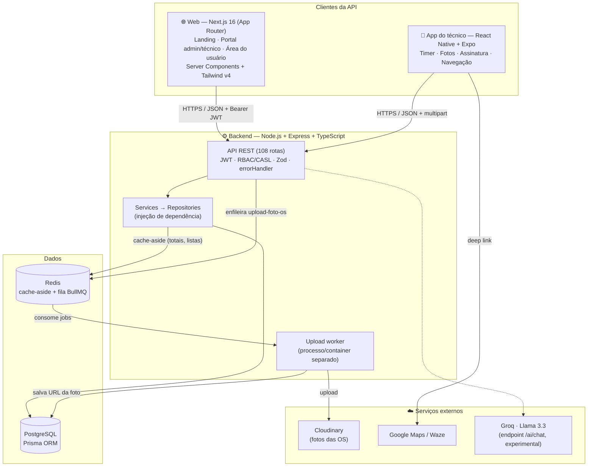
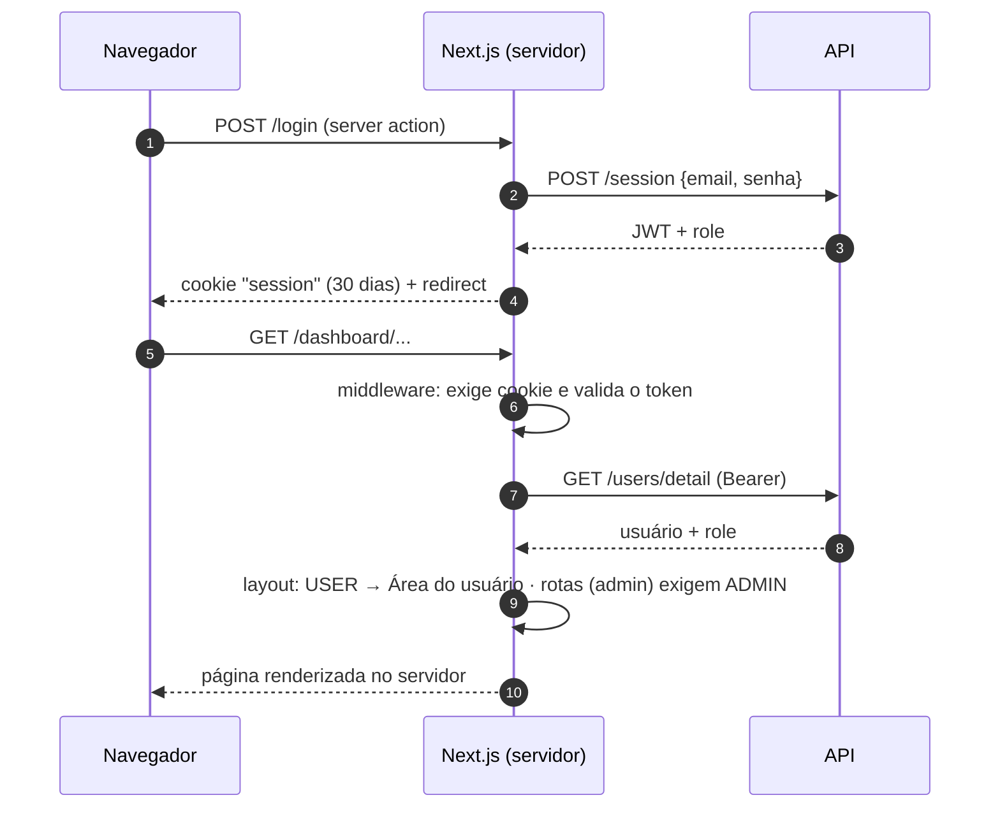
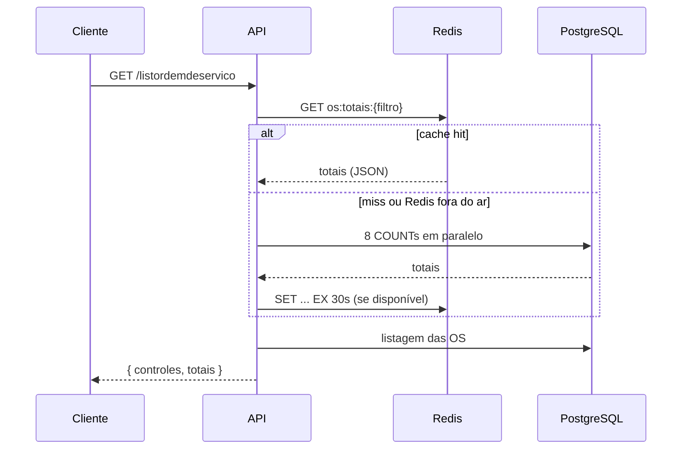
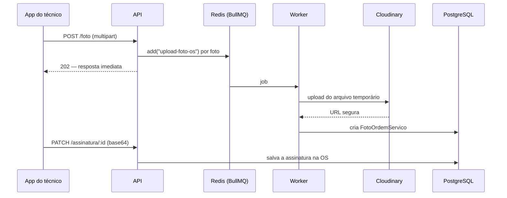

# Ordem Next — Service Order Management SaaS

> Antes chamado **Fire OS**.

## ▶ Demonstração em Vídeo

https://github.com/user-attachments/assets/e92169b7-23c2-4fe3-bc6a-10abf8c70550


### *"Ordens de serviço do chamado à assinatura, em 2 telas."*

Técnicos de campo gastam mais tempo preenchendo sistema do que resolvendo problemas. O Ordem Next reduz cada atendimento de 5–6 telas para 2. Nasceu no suporte de TI e hoje atende qualquer empresa de serviços: TI, climatização, elétrica, oficinas e mais.

<p align="center">
  <a href="https://nextjs.org/"></a>
  <a href="https://react.dev/"></a>
  <a href="https://tailwindcss.com/"></a>
  <a href="https://reactnative.dev/"></a>
  <a href="https://expo.dev/"></a>
  <a href="https://www.typescriptlang.org/"></a>
  <a href="https://nodejs.org/"></a>
  <a href="https://www.postgresql.org/"></a>
  <a href="https://www.prisma.io/"></a>
  <a href="https://redis.io/"></a>
  <a href="https://www.docker.com/"></a>
</p>

<p align="center">
  
  
  
  
  
</p>

---

## 🎯 O Problema Real

Empresas de serviço em campo, a começar pelas de TI terceirizada que atendem prefeituras, escolas e postos de saúde, costumam depender de sistemas legados. Neles, o técnico precisa navegar por **5 a 6 telas diferentes** para registrar uma única ordem de serviço, e acaba gastando mais tempo no software do que no serviço.

**O Ordem Next resolve isso.** Identifiquei o problema atuando como técnico de helpdesk N2 e construí, solo, um sistema que unifica todo o fluxo em **2 telas**: um app mobile para o técnico em campo e um painel web para o gestor. Os clientes abrem chamados por uma área própria.

---

## 📈 Validação em Uso Real

O sistema foi implantado em ambiente real de trabalho para validação, processando ordens de serviço de equipes técnicas que atendem instituições públicas.

| Métrica | Antes (Sistema Legado) | Depois (Ordem Next) | Ganho |
|---|---|---|---|
| Telas por OS | 5–6 telas | **2 telas** | **−66% complexidade** |
| Esforço de input | 100% manual/fragmentado | Fluxo otimizado | **−83% esforço** |
| Mobilidade | Zero | App nativo iOS/Android | **100% field-ready** |

- **47 ordens de serviço** processadas em **2 meses de uso real**
- **44 OS concluídas com sucesso** (94%) pelo fluxo otimizado
- Validação direta com técnicos de campo e gestores em ambiente de trabalho real

---

## 🏗️ Arquitetura do Sistema

O Ordem Next é um **monorepo com 3 aplicações** que falam com a mesma API REST:



*Camadas internas do backend, sequências de request e cache e o "antes vs. depois" de cada pilar estão em [`Backend/estudos-pleno/ARQUITETURA-ANTES-DEPOIS.md`](Backend/estudos-pleno/ARQUITETURA-ANTES-DEPOIS.md).*

---

## 🔄 Comunicação entre as camadas

### 1. Autenticação e papéis

Três perfis: `ADMIN` (gestor), `TECNICO` (equipe de campo) e `USER` (cliente que abre chamados).



- **Papel resolvido no servidor.** No frontend, o papel sempre vem da API (`lib/session.ts`) e nunca de um cookie editável pelo navegador. As rotas de administração ficam no route group `app/dashboard/(admin)`, cujo layout chama `requireRole("ADMIN")`.
- **Autorização na API.** Toda rota privada passa por `isAuthenticated` (JWT). As rotas sensíveis passam ainda por RBAC (`can`) e por verificação de dono do recurso com CASL (`authorizeOwnership`): só `ADMIN` remove entidades críticas, e o técnico só edita a OS atribuída a ele.
- **Chamadas diretas do navegador.** No cliente, o axios anexa o token por um interceptor. O cookie de sessão ainda **não** é `HttpOnly`, porque parte das chamadas sai direto do navegador para a API. Movê-las para o servidor (BFF) está no roadmap.

### 2. Leitura com cache (painel de OS)



A cada abertura do painel, os 8 `COUNT` somados à listagem davam 9 consultas. Com o cache, os totais saem de uma única leitura no Redis, com TTL por tipo de dado. Se o Redis cair, a rota continua respondendo direto do banco.

### 3. Fotos e assinatura do atendimento



O upload não bloqueia mais a requisição: a API só entrega um job por foto e responde na hora. O worker roda em outro processo (`npm run worker`) e, no Docker, em outro container, com um volume `/tmp` compartilhado para ler o arquivo.

---

## 📁 Estrutura do Projeto

```
Fire-OS-Service-Order-SaaS/            # Monorepo
│
├── Frontend/                          # Next.js 16 — Landing, portal web e área do usuário
│   ├── public/
│   │   ├── brand/                     # Logotipo e ícone Ordem Next (SVG/PNG)
│   │   └── segments/                  # Fotos CC0 dos segmentos (WebP) + CREDITS.md
│   ├── scripts/dev-mock.mjs           # `npm run dev:mock` — UI inteira sem backend
│   └── src/
│       ├── app/
│       │   ├── page.tsx               # Landing page
│       │   ├── login/                 # Portal administrativo (admin/técnico)
│       │   ├── AreadeUsuario/         # Login e abertura de chamados do cliente
│       │   ├── signup_*/              # Cadastro de usuários (somente ADMIN)
│       │   ├── os-digital/[id]/       # OS digital pública (imprimir/baixar PDF)
│       │   └── dashboard/
│       │       ├── tickets/           # Lista de chamados, relatórios Excel
│       │       ├── ordemdeservico/    # Página da OS
│       │       ├── documentacaoTecnica/
│       │       └── (admin)/           # Route group com requireRole("ADMIN"):
│       │                              # calendário, controles, clientes, usuários, cadastros
│       ├── components/
│       │   ├── ui/                    # Design system: Button, Card, Badge, Field, Modal…
│       │   ├── data/                  # EntityList, EntityForm, DetailModal, FormPage
│       │   ├── layout/                # Sidebar, Header, tema claro/escuro
│       │   ├── auth/                  # Layout das telas de login/cadastro
│       │   └── brand/                 # <Logo /> e <LogoMark />
│       ├── features/<entidade>/       # Lista, modal e campos de cada entidade
│       ├── lib/                       # session, serverApi, format, status, tipos
│       ├── mocks/                     # Fixtures e adapter do modo mock
│       └── services/api.ts            # Axios + interceptor do token
│
├── Backend/                           # Node.js + Express — API REST
│   ├── prisma/                        # schema.prisma + migrations versionadas
│   ├── Dockerfile · docker-compose.yml  # Postgres, Redis, API e worker
│   └── src/
│       ├── routes.ts                  # Registro das 108 rotas (públicas e privadas)
│       ├── controllers/               # Entrada HTTP por módulo
│       ├── services/                  # Regras de negócio
│       ├── repositories/              # Acesso a dados (Prisma), injetável/mockável
│       ├── schemas/                   # Validação Zod por entidade
│       ├── Middleware/                # isAuthenticated, can, authorizeOwnership, validate, errorHandler
│       ├── permissions/ability.ts     # Regras CASL por papel
│       ├── errors/AppError.ts         # Erros de domínio → status HTTP
│       ├── queue/                     # Fila BullMQ, worker de upload e Bull Board
│       ├── redis/                     # Cliente Redis (cache-aside)
│       ├── api/ai/chat/               # Endpoint experimental de IA (Groq)
│       └── test/integration/          # Testes de integração/E2E (Testcontainers)
│
└── FireOS-App/                        # React Native + Expo — App do Técnico
    └── src/
        ├── pages/                     # Signin, Dashboard, ListOrdemdeServicoInterna
        ├── components/                # Modais de OS, atendimento, tickets internos
        ├── contexts/AuthContext.tsx   # Sessão do técnico
        ├── routes/                    # Rotas autenticadas e públicas
        └── services/api.ts            # Axios configurado
```

---

## ✨ Funcionalidades

### 💻 Web (Next.js)

**Landing e acesso**
- Landing page com carrossel de segmentos, fluxo de trabalho e uma vitrine por segmento (oficinas, assistência técnica, climatização, TI, telecom, elétrica e outros)
- Portal administrativo, Área do Usuário e cadastro com layout próprio: fotos de profissionais, campos com ícone e mostrar/ocultar senha
- Área do Usuário: o cliente abre chamados com os próprios dados (empresa/instituição e setor) já vinculados

**Painel**
- Painel inicial com KPIs, chamados recentes, distribuição por status e atalhos
- Lista de chamados com 7 filtros, busca, paginação e atualização automática, além de exportação Excel e relatório por secretaria
- OS com abas (detalhes, atendimento, fotos, assinatura), edição e página imprimível (OS digital com download em PDF)
- Calendário técnico (mês, semana e agenda) com reagendamento por arrastar e ajuste de horário
- Controles: equipamentos, estabilizadores, assistência técnica, laudos, laboratório, máquinas pendentes e compras
- Clientes privados e municipais, ramais, setores, usuários, técnicos e documentação técnica

**Base técnica**
- Design system próprio, inspirado no template Modernize, com tema claro e escuro
- Componentes genéricos (`EntityList`, `EntityForm`, `DetailModal`) no lugar de dezenas de telas copiadas
- Datas "somente dia" gravadas ao meio-dia UTC, para não voltar um dia no fuso de Brasília
- `npm run dev:mock`: a interface inteira roda sobre fixtures, sem backend

### 📱 Mobile (React Native + Expo)
- Lista filtrada automaticamente pelo técnico atribuído
- Timer de OS: iniciar → pausar → retomar → concluir, com cálculo da duração real
- Geolocalização com deep link para Waze e Google Maps
- Fotos via `expo-image-picker`, enviadas à API e processadas pela fila de upload
- Assinatura digital do responsável (`react-native-signature-canvas`)
- Atualizações OTA com EAS Update

### ⚙️ Backend (Node.js + Express)
- API REST com 108 rotas e separação clara entre rotas públicas e privadas
- **Autenticação e autorização:**
  - JWT
  - RBAC por papel
  - Verificação de dono do recurso com CASL
- **Validação e erros:**
  - Validação de entrada com Zod: 22 schemas, com erro 422 que lista os campos inválidos
  - `errorHandler` global: erros de domínio e do Prisma viram o status HTTP correto
- **Camada de Repository com injeção de dependência** (35 repositories): os services não falam direto com o Prisma, então ficam testáveis com repositories fake
- **Cache-aside com Redis** (totais de status, lista de técnicos): TTL por tipo de dado, invalidação ativa na escrita e fallback se o Redis cair
- **Fila BullMQ + Redis** para o upload de fotos: worker em processo separado e painel Bull Board para desenvolvimento (`npm run queue:dashboard`)
- **Relatórios:** exportação em Excel com ExcelJS e relatório consolidado por secretaria
- **Segurança:** senhas com bcrypt
- **Banco:** Prisma ORM com migrações versionadas

---

## 🛠 Stack Tecnológica

| Camada | Tecnologias |
|---|---|
| **Frontend Web** | Next.js 16 (App Router, Server Components, server actions), React 19, TypeScript, Tailwind CSS v4, react-select, sonner |
| **Mobile** | React Native 0.76, Expo 52, Context API, AsyncStorage, Axios |
| **Backend** | Node.js, Express, TypeScript, JWT, bcrypt, Zod, CASL |
| **Banco de Dados** | PostgreSQL 15, Prisma ORM |
| **Cache & Filas** | Redis 7 (cache-aside), BullMQ (upload de fotos), Bull Board |
| **Armazenamento** | Cloudinary (imagens) |
| **IA (experimental)** | Groq, Llama 3.3 70B via AI SDK |
| **Testes & CI** | Vitest (215 unitários + 73 de integração/E2E com Testcontainers), GitHub Actions |
| **Infraestrutura** | Docker + Docker Compose (Postgres, Redis, API e worker) |
| **Deploy Mobile** | Expo EAS Build + EAS Update |

---

## 🧪 Qualidade

- **Testes unitários:** 215 casos em 75 arquivos, com o Prisma mockado. Cobrem RBAC/CASL, schemas Zod, `errorHandler`, repositories e cache-aside (hit, miss e fallback).
- **Testes de integração e E2E:** 73 casos em 13 arquivos contra **Postgres real via Testcontainers**, cobrindo auth, CRUDs, fluxos da OS e relatórios.
- **CI no GitHub Actions** (`.github/workflows/test.yml`): typecheck, lint, testes unitários com cobertura (piso de 30%) e testes de integração, em steps separados.
- **Frontend:** `tsc --noEmit` e `next build` sem erros. Testes de interface (Playwright) estão no roadmap.

---

## 🚀 Como Rodar Localmente

### Pré-requisitos
- Node.js 20+
- Docker (para Postgres e Redis) ou PostgreSQL 15 + Redis 7 instalados
- Expo CLI, para o app mobile

### 1. Backend

```bash
cd Backend
npm install
cp .env.example .env          # preencha as variáveis (tabela abaixo)

docker compose up -d fireos-db fireos-redis   # banco e cache
npx prisma migrate dev

npm run dev                   # API em http://localhost:3334
npm run worker                # em outro terminal: worker de upload
```

Tudo em containers (banco, cache, API e worker): `docker compose up --build`.

### 2. Frontend Web

```bash
cd Frontend
npm install
echo "NEXT_PUBLIC_API_URL=http://localhost:3334" > .env.local

npm run dev        # http://localhost:3000
# ou, sem backend nenhum:
npm run dev:mock   # dados fictícios, logado como ADMIN
```

Rotas principais: `/` (landing), `/login` (portal), `/AreadeUsuario` (clientes), `/dashboard`.

### 3. App Mobile

```bash
cd FireOS-App
npm install
# configure a URL da API em src/services/api.ts
npx expo start
```

### Variáveis de Ambiente

| Variável | Onde | Descrição |
|---|---|---|
| `DATABASE_URL` | Backend | String de conexão PostgreSQL |
| `JWT_SECREATE` | Backend | Chave secreta dos tokens JWT (o nome com typo é histórico e foi mantido porque produção já o usa) |
| `REDIS_URL` | Backend | Conexão do Redis (cache e fila) |
| `CLOUDINARY_NAME` · `CLOUDINARY_KEY` · `CLOUDINARY_SECRET` | Backend | Credenciais do Cloudinary |
| `GROQ_API_KEY` | Backend | Opcional, só para o endpoint experimental `/ai/chat` |
| `NEXT_PUBLIC_API_URL` | Frontend | URL base da API |
| `NEXT_PUBLIC_MOCK_API` · `NEXT_PUBLIC_MOCK_ROLE` | Frontend | Definidas pelo `npm run dev:mock` (modo sem backend e papel simulado) |

---

## 🏁 Contexto de Desenvolvimento

Desenvolvido solo, **fora do horário de trabalho**, em paralelo com a atuação como técnico de helpdesk N2. Identifiquei o problema observando o dia a dia de campo, construí a solução do zero e validei cada feature diretamente com técnicos e gestores em ambiente real de trabalho.

O protótipo funcional foi apresentado com 3 módulos-chave e teve uso real validado: **47 ordens de serviço em 2 meses**, com **44 concluídas com sucesso**. Essa entrega comprovou a robustez da solução e resultou em **promoção a Desenvolvedor Fullstack antes de completar 1 ano na empresa**.

Hoje mantenho o projeto como portfólio autoral e continuo evoluindo a arquitetura e as funcionalidades de forma independente.

---

## 🔜 Roadmap Técnico

- [x] **Autorização (RBAC + CASL):**
  - Controle por papel (ADMIN/TECNICO/USER) nas rotas críticas da API e por dono do recurso na OS.
  - No frontend, o papel é resolvido no servidor, com um route group protegido para a administração.
- [x] **Infraestrutura:** Dockerfile multi-stage e Docker Compose com Postgres, Redis, API e worker (`docker compose up --build`).
- [x] **Arquitetura:** mapa com diagramas (mermaid) das camadas antes/depois, dos fluxos de request e cache e da resposta de escala ("o que quebraria com 1000 técnicos") em [`Backend/estudos-pleno/ARQUITETURA-ANTES-DEPOIS.md`](Backend/estudos-pleno/ARQUITETURA-ANTES-DEPOIS.md).
- [x] **Validação & erros:** schemas Zod e `errorHandler` global padronizando as respostas de erro da API.
- [x] **Repository pattern** com injeção de dependência nos services.
- [x] **Cache-aside com Redis** nos totais do painel e na lista de técnicos, com fallback.
- [x] **Fila assíncrona:** upload de fotos via BullMQ com worker separado.
- [x] **Testes:** unitários com Vitest e integração/E2E com Testcontainers (Postgres real).
- [x] **CI:** GitHub Actions com typecheck, lint, testes unitários e testes de integração.
- [x] **Frontend redesenhado:**
  - Design system em Tailwind v4, tema escuro e componentes genéricos.
  - Landing page, telas de login novas e calendário próprio no lugar do DHTMLX.
  - Modo mock e rebrand para Ordem Next.
- [ ] **Sessão só no servidor (BFF):** levar as chamadas do navegador para o servidor Next.js e tornar o cookie de sessão `HttpOnly`.
- [ ] **Testes de interface** com Playwright no frontend.
- [ ] **API:**
  - Tornar `patrimoniodoequipamento` opcional na criação de OS pelo painel.
  - Criar rotas de exclusão para usuários, ramais, estabilizadores e OS.
  - Permitir remover atividades de uma OS.
- [ ] **Features avançadas:** notificações push no app (Expo Notifications) e transcrição de áudio para a documentação técnica.

---

## 📄 Licença

MIT © [Pablo Cruz](https://github.com/pablo-cruzbr) · Founder: [pablocruz.vercel.app](https://pablocruz.vercel.app/)

---

<p align="center">
  <strong>GO GLOBAL OR NOTHING</strong>
</p>
